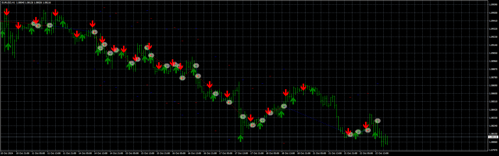

# FastSlowRVIsCrossOver_MT4_Indi_EA

> Source: https://fxcodebase.com/code/viewtopic.php?f=38&t=75297  
> Forum: 38 · Topic 75297 · 7 post(s)

---

## FastSlowRVIsCrossOver_MT4_Indi_EA

**Apprentice** · Tue Oct 22, 2024 11:38 am

Based on the request.
[https://fxcodebase.com/code/viewtopic.php?f=38&t=75282](https://fxcodebase.com/code/viewtopic.php?f=38&t=75282)

 [FastSlowRVIsCrossOver_MT4_Indi.mq4](files/157049/FastSlowRVIsCrossOver_MT4_Indi.mq4)

 [FastSlowRVIsCrossOver_MT4_Indi_EA_v1,00.mq4](files/157049/FastSlowRVIsCrossOver_MT4_Indi_EA_v100.mq4)

---

## Re: FastSlowRVIsCrossOver_MT4_Indi_EA

**rgarcia** · Sat Feb 15, 2025 1:43 pm

I think we can improve it with a EMA Filter, by default we can use the 200 periods, but let the input available to change the ema params

Filter:
Price Above ema, only buys
Price Below ema, only sells

thanks

---

## Re: FastSlowRVIsCrossOver_MT4_Indi_EA

**Apprentice** · Mon Feb 17, 2025 1:22 pm

We have added your request to the development list.
Development reference 120

---

## Re: FastSlowRVIsCrossOver_MT4_Indi_EA

**Apprentice** · Wed Feb 19, 2025 6:51 am

[FastSlowRVIsCrossOver_MT4_Indi_EA_v1.10.mq4](files/158311/FastSlowRVIsCrossOver_MT4_Indi_EA_v1.10.mq4)

Try this version.

---

## Re: FastSlowRVIsCrossOver_MT4_Indi_EA

**rgarcia** · Mon Mar 10, 2025 12:57 pm

hello, nice work!
please add this martingale system: when a trade is loser, for the next trader increse the lots (by multiplier)

thanks

---

## Re: FastSlowRVIsCrossOver_MT4_Indi_EA

**Apprentice** · Mon Mar 10, 2025 2:23 pm

We have added your request to the development list.
Development reference 167

---

## Re: FastSlowRVIsCrossOver_MT4_Indi_EA

**Apprentice** · Wed Mar 19, 2025 2:30 pm

[FastSlowRVIsCrossOver_MT4_Indi_EA_v1.20.mq4](files/158675/FastSlowRVIsCrossOver_MT4_Indi_EA_v1.20.mq4)

Try this version.
