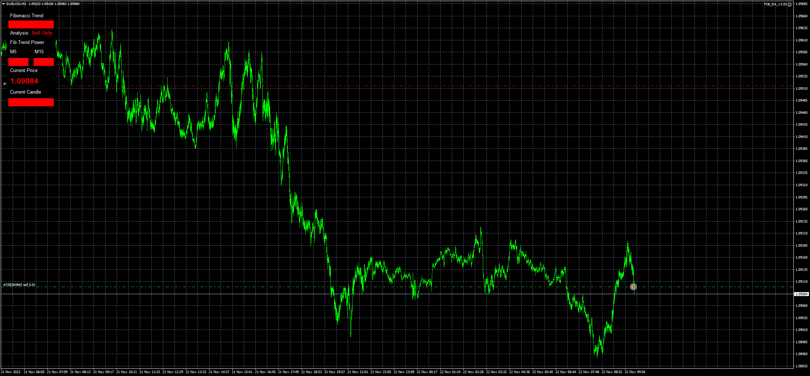

# FIB_EA

> Source: https://fxcodebase.com/code/viewtopic.php?f=38&t=74355  
> Forum: 38 · Topic 74355 · 3 post(s)

---

## FIB_EA

**Apprentice** · Wed Nov 22, 2023 3:23 am

Based on the request.
[https://fxcodebase.com/code/viewtopic.p ... 83#p152783](https://fxcodebase.com/code/viewtopic.php?f=27&p=152783#p152783)

 [FibonacciTrend.ex4](files/153368/FibonacciTrend.ex4)

 [FIB_EA_v1.01.mq4](files/153368/FIB_EA_v1.01.mq4)

---

## Re: FIB_EA

**jacryptoking** · Fri Nov 24, 2023 5:34 am

> **Apprentice wrote:**
>
>
> eurusd-m1-fxcm-australia-pty.png
>
>
> Based on the request.
> [https://fxcodebase.com/code/viewtopic.p ... 83#p152783](https://fxcodebase.com/code/viewtopic.php?f=27&p=152783#p152783)
>
>
> FibonacciTrend.ex4
>
>
>
>
> FIB_EA_v1.01.mq4

 Hi good day . Can you convert to mql5 ?

---

## Re: FIB_EA

**Apprentice** · Tue Nov 28, 2023 9:41 am

We have added your request to the development list.
Development reference 1048
