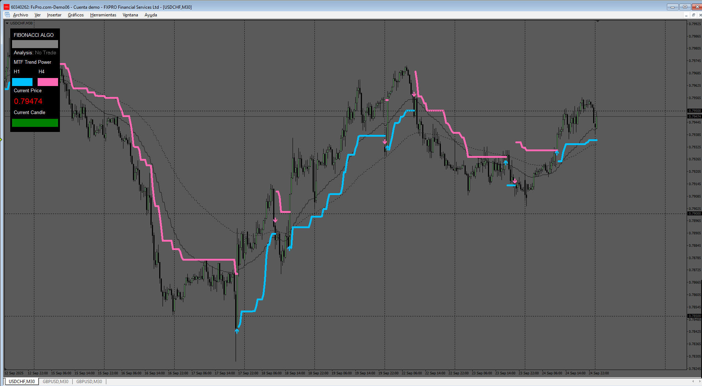
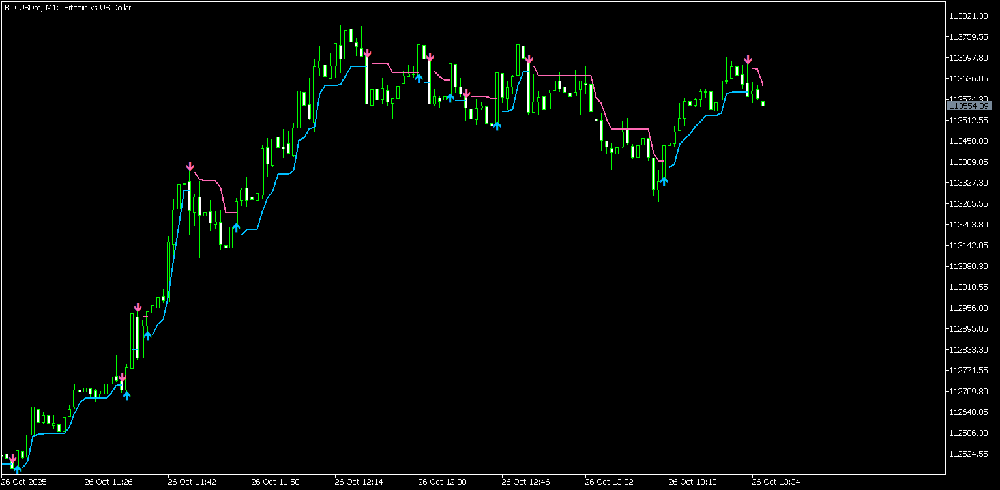
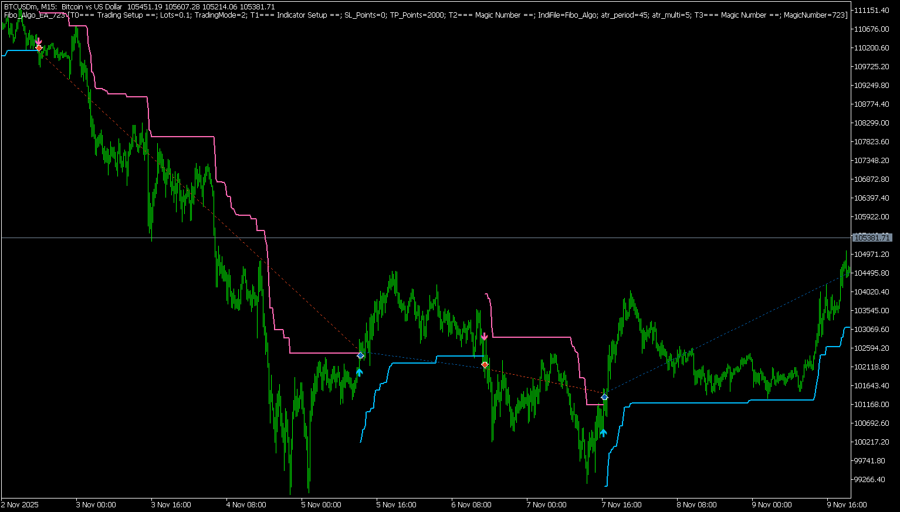

# Fibo_Algo

> Source: https://fxcodebase.com/code/viewtopic.php?f=38&t=76331  
> Forum: 38 · Topic 76331 · 9 post(s)

---

## Fibo_Algo

**Apprentice** · Sat Sep 27, 2025 4:29 pm

Based on the request.
[https://fxcodebase.com/code/viewtopic.p ... 84#p160484](https://fxcodebase.com/code/viewtopic.php?f=27&p=160484#p160484)

 [Fibo_Algo.mq4](files/160653/Fibo_Algo.mq4)

---

## Re: Fibo_Algo

**Pensioner** · Mon Sep 29, 2025 7:56 am

Hi! Thank you for your work!
However, buffers "0" and "1" work in reverse: "0" is a sell, and "1" is a buy. Apparently, this is why my constructor doesn't work correctly when connecting another indicator.
Also, buffers "5" and "6" don't work at all, and I couldn't figure out why.
Dear colleague, if possible, could you make some minor changes to the code?
I'd be very grateful for your help!

---

## Re: Fibo_Algo

**Apprentice** · Wed Oct 01, 2025 6:11 am

We have added your request to the development list.
Development reference 615

---

## Re: Fibo_Algo

**Apprentice** · Sun Oct 12, 2025 3:56 am

 [Fibo_Algo.mq4](files/160885/Fibo_Algo.mq4)

---

## Re: Fibo_Algo

**Pensioner** · Sun Oct 26, 2025 9:28 am

Спасибо, друг!!!

---

## Re: Fibo_Algo

**Apprentice** · Thu Oct 30, 2025 4:12 am

 [Fibo_Algo.mq5](files/161105/Fibo_Algo.mq5)

---

## Re: Fibo_Algo

**abdultned** · Fri Oct 31, 2025 2:49 am

Hello Sir,

Please convert this indicator to Expert Advisor EA

Thanks

---

## Re: Fibo_Algo

**Apprentice** · Sun Nov 09, 2025 8:33 am

We have added your request to the development list.
Development reference 723

---

## Re: Fibo_Algo

**Apprentice** · Tue Nov 11, 2025 4:46 am

 [Fibo_Algo_EA.mq5](files/161196/Fibo_Algo_EA.mq5)
