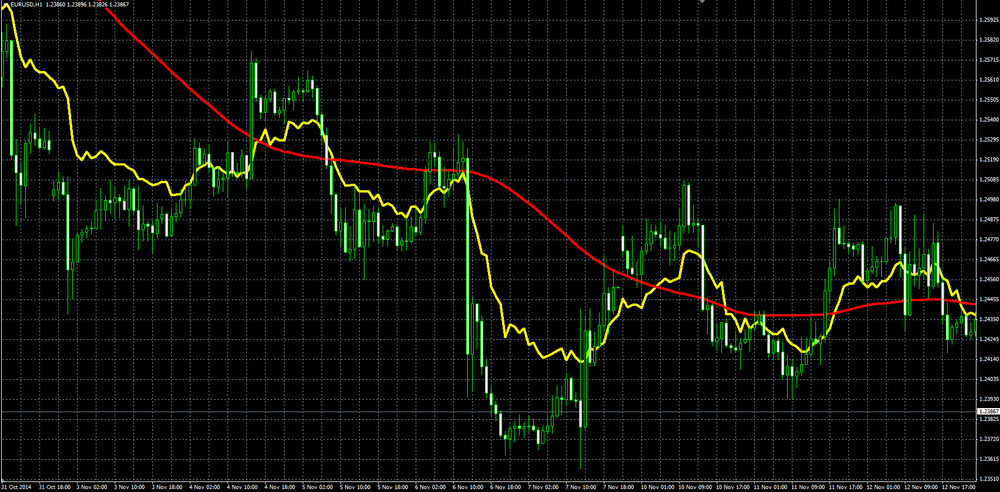

# Fibo averages indicator

> Source: https://fxcodebase.com/code/viewtopic.php?f=38&t=61515  
> Forum: 38 · Topic 61515 · 1 post(s)

---

## Fibo averages indicator

**Alexander.Gettinger** · Fri Nov 21, 2014 4:55 pm

Fibo average is an average of [FiboCount] prices with fibo shift. For example, if [FiboCount]=8 Fibo[i]=(Price[i]+Price[i-1]+Price[i-1]+Price[i-2]+Price[i-3]+Price[i-5]+Price[i-8]+Price[i-13])/8.
MA is a average of Fibo.

 

Download:

 [Fibo_Average.mq4](files/97285/Fibo_Average.mq4)
