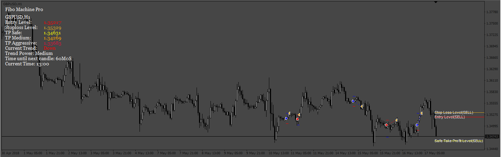
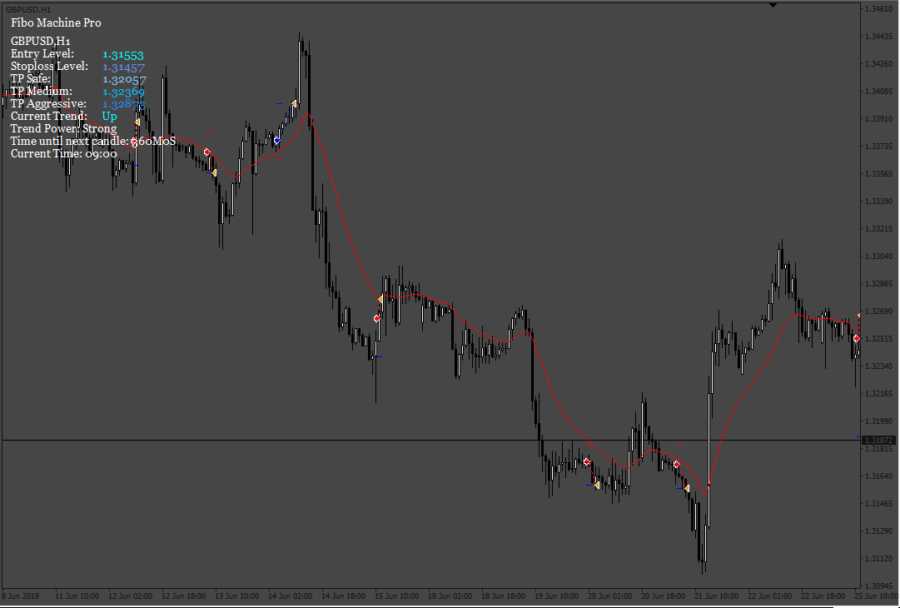

# Fibo_Machine_Pro_EA

> Source: https://fxcodebase.com/code/viewtopic.php?f=38&t=71878  
> Forum: 38 · Topic 71878 · 13 post(s)

---

## Fibo_Machine_Pro_EA

**Apprentice** · Mon Feb 14, 2022 3:18 am

Based on the request.
[https://fxcodebase.com/code/viewtopic.php?f=27&t=71755](https://fxcodebase.com/code/viewtopic.php?f=27&t=71755)

 [FiboMachinePro.ex4](files/145016/FiboMachinePro.ex4)

 [Fibo_Machine_Pro_EA.mq4](files/145016/Fibo_Machine_Pro_EA.mq4)

---

## Re: Fibo_Machine_Pro_EA

**PhenomDC** · Mon Oct 17, 2022 5:41 pm

Hello Apprentice, hope you're doing well. Please could you add a few features on this EA; (1) where we are able to control the number of re-entry trades. Also, add a feature for max daily risk % (drawdown). Once it is hit, the bot is done for that day.(till the next day). Thanks and God bless.

---

## Re: Fibo_Machine_Pro_EA

**Apprentice** · Tue Oct 18, 2022 1:48 am

We have added your request to the development list.
Development reference 655.

---

## Re: Fibo_Machine_Pro_EA

**Apprentice** · Wed Oct 26, 2022 11:28 am

 [Fibo_Machine_Pro_EA.mq4](files/148024/Fibo_Machine_Pro_EA.mq4)

---

## Re: Fibo_Machine_Pro_EA

**PhenomDC** · Thu Oct 27, 2022 8:35 am

Hello Apprentice, hope you're doing well. Great work here but I think the EA needs a filter (perhaps MA). When 3 consecutive candles close below the MA, let fibo signal be "buy". Vice versa, when consecutive candles close above MA, let fibo be on "sell" signal. Thanks for all you do.

---

## Re: Fibo_Machine_Pro_EA

**apeg1987** · Fri Oct 28, 2022 10:34 am

Hi,

What is the best TimeFrame for Fibo_Machine?

Thank you

---

## Re: Fibo_Machine_Pro_EA

**Apprentice** · Sun Oct 30, 2022 4:22 am

We have added your request to the development list.
Development reference 690.

---

## Re: Fibo_Machine_Pro_EA

**Apprentice** · Fri Nov 04, 2022 2:48 am

Filter added.

 [Fibo_Machine_Pro_EA.mq4](files/148139/Fibo_Machine_Pro_EA.mq4)

---

## Re: Fibo_Machine_Pro_EA

**PhenomDC** · Sun Nov 06, 2022 7:54 pm

Hello Apprentice, hope you're ok. Critical error in the code. I'm not able to use it

---

## Re: Fibo_Machine_Pro_EA

**Apprentice** · Mon Nov 07, 2022 5:20 am

We have added your request to the development list.
Development reference 716.

---

## Re: Fibo_Machine_Pro_EA

**Apprentice** · Tue Nov 08, 2022 6:58 am

I tested the EA and work fine, maybe you didn't have the indicator...
I made a little change in the code to Alert you about it.

---

## Re: Fibo_Machine_Pro_EA

**Jowzy27** · Mon Aug 14, 2023 4:30 am

> **PhenomDC wrote:**
> Hello Apprentice, hope you're doing well. Great work here but I think the EA needs a filter (perhaps MA). When 3 consecutive candles close below the MA, let fibo signal be "buy". Vice versa, when consecutive candles close above MA, let fibo be on "sell" signal. Thanks for all you do.

Hi Apprentice, all well I hope.
1.It seems you implemented this request. However, I don't understand the logic of the conditions provided above. What is the explanation? Did they improve performance?

2. Looking at different development of the Fibo Machine Pro there is no indication of the versions (such as numbering) as this EA is taken through various stages. How do we tell which version carries what development?

---

## Re: Fibo_Machine_Pro_EA

**Apprentice** · Wed Aug 16, 2023 2:42 pm

We have added your request to the development list.
Development reference 719.
