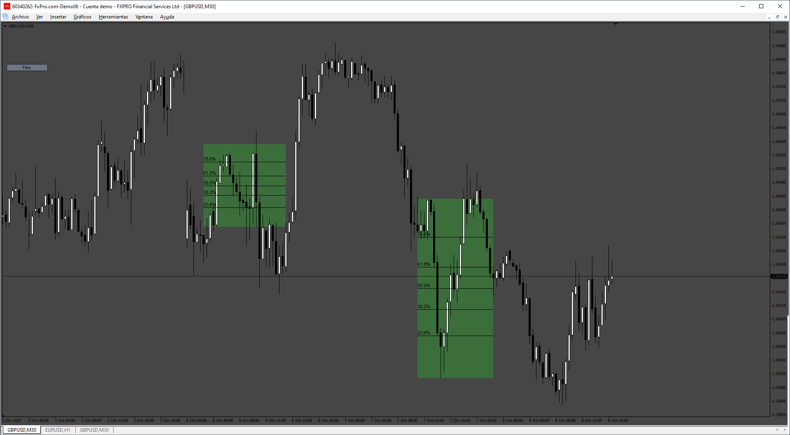

# Fibo_Rectangle

> Source: https://fxcodebase.com/code/viewtopic.php?f=38&t=76368  
> Forum: 38 · Topic 76368 · 4 post(s)

---

## Fibo_Rectangle

**Apprentice** · Sun Oct 12, 2025 2:01 am

TS 2 version.
[https://fxcodebase.com/code/viewtopic.p ... 71#p160671](https://fxcodebase.com/code/viewtopic.php?f=17&p=160671#p160671)

 [Fibo_Rectangle.mq4](files/160853/Fibo_Rectangle.mq4)

---

## Re: Fibo_Rectangle

**khanatd** · Mon Oct 20, 2025 11:28 pm

hi sir can arrows non repaint b added in it at crossovers reversals etc?

thanks
khan

---

## Re: Fibo_Rectangle

**Apprentice** · Tue Oct 21, 2025 9:46 am

We have added your request to the development list.
Development reference 688

---

## Re: Fibo_Rectangle

**Apprentice** · Wed Oct 29, 2025 4:10 pm

[Fibo_Rectangle_v2.mq4](files/161097/Fibo_Rectangle_v2.mq4)
