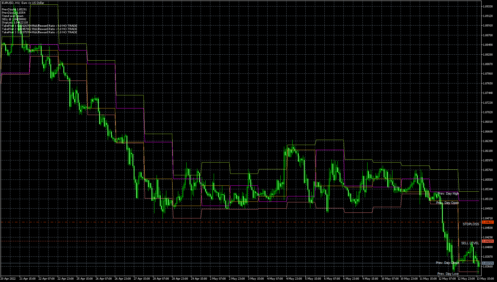

# fibocalc_v34

> Source: https://fxcodebase.com/code/viewtopic.php?f=38&t=72171  
> Forum: 38 · Topic 72171 · 8 post(s)

---

## fibocalc_v34

**Apprentice** · Fri May 13, 2022 9:08 am

Based on the request.
[https://fxcodebase.com/code/viewtopic.php?f=27&p=145779](https://fxcodebase.com/code/viewtopic.php?f=27&p=145779)

 [fibocalc_v34.mq5](files/145969/fibocalc_v34.mq5)

---

## Re: fibocalc_v34

**pvmscalp** · Tue Sep 13, 2022 6:25 am

Hi Apprentice

Is it possible to convert this to afl code ?

Regards
pvm

---

## Re: fibocalc_v34

**Apprentice** · Thu Sep 15, 2022 5:07 am

We do not provide support for afl

---

## Re: fibocalc_v34

**pvmscalp** · Sun Oct 09, 2022 1:35 am

Hi

can you please update the indicator with values lile Prev Day High@price , Prev Day Lo@price shown at right side all days

like for EURUSD Prev Day High @1.04546 the buffer values should be printed every day above the line right side for Mq4 fibocalc

Thanks

---

## Re: fibocalc_v34

**Apprentice** · Tue Oct 11, 2022 3:15 am

maybe add them as additional channel lines?

---

## Re: fibocalc_v34

**Apprentice** · Tue Oct 11, 2022 3:15 am

We have added your request to the development list.
Development reference 639.

---

## Re: fibocalc_v34

**pvmscalp** · Wed Oct 12, 2022 11:07 am

Hi

I have attached the Mq4 indicator from you and the screenshot shows the requirement

Thanks

---

## Re: fibocalc_v34

**Apprentice** · Tue Nov 01, 2022 3:29 am

[FiboCalc_button_1.1.mq4](files/148112/FiboCalc_button_1.1.mq4)

Try this version.
