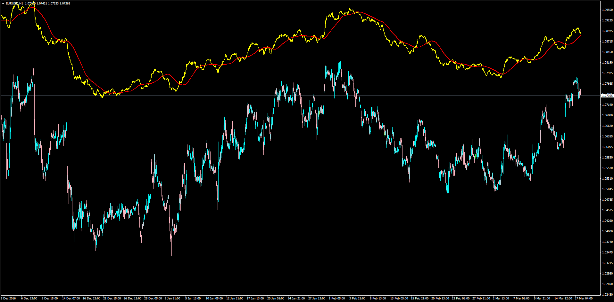

# Fibonacci Averages

> Source: https://fxcodebase.com/code/viewtopic.php?f=38&t=64531  
> Forum: 38 · Topic 64531 · 8 post(s)

---

## Fibonacci Averages

**Apprentice** · Sat Mar 18, 2017 5:28 am

LUA Original: [viewtopic.php?f=17&t=5277](https://fxcodebase.com/code/viewtopic.php?f=17&t=5277)

Description:

This is the MT4 version of the LUA original "Fibo Averages".

With this indicators it is worth to express a few interesting comments/conclusions:

- As with any "average", price will always tend to cross it from down to up and vice versa
- Countrary to most moving averages out there, this one takes a sample of various prices according to the fibonacci sequence. The greater the Fibo number the farther beyond the next sample price is
- The sequence goes like this: 0, 1, 1, 2, 3, 5, 8, 13, 21, 34, 55, 89, 144, ..., 17711, 28657, 46368, ...
- Notice how the next one is becoming more separated from the previous numbers... when it gets to Fibo[23] it is 17711, then the next one is 28657 that and the Fibo[25] is 46368
- All this means that this indicator will take a huge jump to take the next price for completing the average, and this fact is interesting for the following reason: it records an historic average of the instrument (as long as there are sufficient bars to do this)
- As a result price will, at times, be separated by certain amount of pips (sometimes a few hundreds, even 500 pips) of this historical "Mean". This is a good technical tool to assess when price is too separated from the historical price of the instrument. After all, price always has to visit the center line. This behavior of course only happens with Big Fibo Numbers. In the picture attached a Fibo_Prices of 23 has been set (By the way, 25 is the maximum, after that it stops working in my H1 chart which has 65,000 historical candles, so it depends on how many bars there are on the records). You can notice how price has been trading below the historical mean line. Eventually it will resume hit it. There have been times when it separates in the range of 300 and 500 pips and it goes again to hit it.

The indicator is completed with a MA of this Fibo Line. This is a regular MA of n periods calculated from the historic fibo average.

 [FiboAverages.mq4](files/111530/FiboAverages.mq4)

---

## Re: Fibonacci Averages

**MT4Trader** · Mon Feb 18, 2019 5:30 am

Hi,

Will you please add arrows for yellow line cross over,

If yellow line cross over red line buy arrow with push,window,mail notification.

If red line cross over yellow line sell signal same as bove.

---

## Re: Fibonacci Averages

**Apprentice** · Mon Feb 18, 2019 6:16 am

Your request is added to the development list under Id Number 4486

---

## Re: Fibonacci Averages

**MT4Trader** · Mon Feb 18, 2019 11:20 am

Thanks

---

## Re: Fibonacci Averages

**Apprentice** · Tue Feb 19, 2019 5:42 am

Try this version.

 [FiboAverages v.1.1.mq4](files/124005/FiboAverages%20v.1.1.mq4)

---

## Re: Fibonacci Averages

**MT4Trader** · Tue Feb 19, 2019 6:06 am

Hi,

I am testing it now, is it possible to wait for few candles after cross over to avoid false breakouts or multiple signals.

screenshots will refer what i am trying to say, how can we avoid such situation.

*Summary of Requirement is arrow must generate after crossover and after few candles pass in same direction.

---

## Re: Fibonacci Averages

**Apprentice** · Tue Feb 19, 2019 7:28 am

Your request is added to the development list under Id Number 4488

---

## Re: Fibonacci Averages

**Apprentice** · Thu Feb 21, 2019 7:55 am

[FiboAverages v.1.2.mq4](files/124040/FiboAverages%20v.1.2.mq4)

Try this version.
