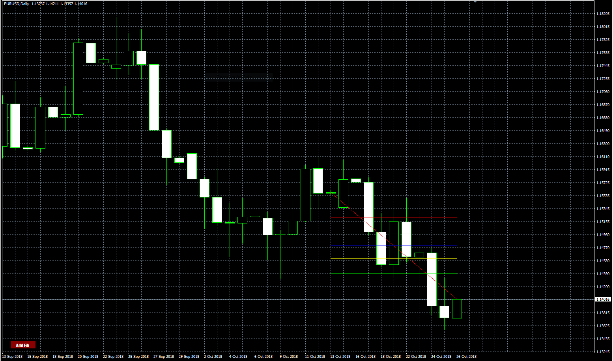
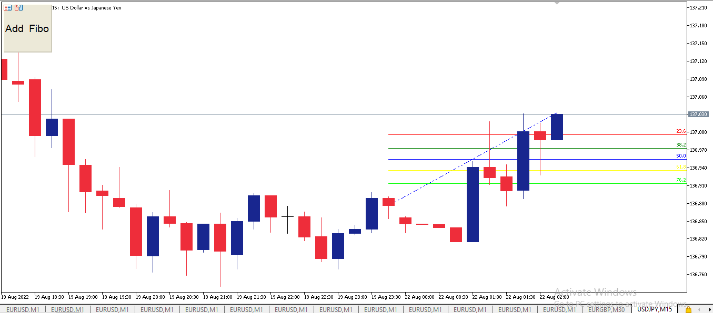
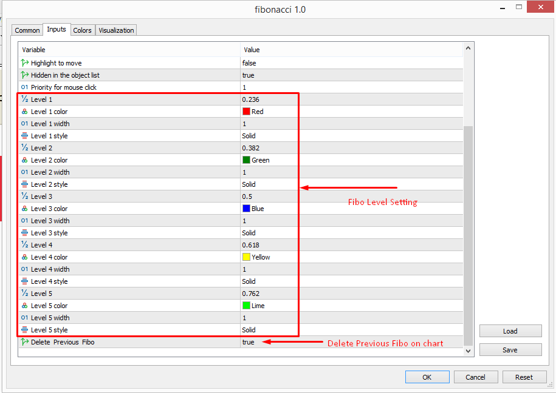

# Fibonacci

> Source: https://fxcodebase.com/code/viewtopic.php?f=38&t=68375  
> Forum: 38 · Topic 68375 · 7 post(s)

---

## Fibonacci

**Apprentice** · Tue Apr 23, 2019 6:29 am

Based on request.
[viewtopic.php?f=27&t=67397](https://fxcodebase.com/code/viewtopic.php?f=27&t=67397)

 [Fibonacci.mq4](files/125904/Fibonacci.mq4)

 

 

 [fibonacci.mq5](files/125904/fibonacci.mq5)

---

## Re: Fibonacci

**logicgate** · Wed Apr 24, 2019 8:53 am

Thanks buddy gonna check it out.

---

## Re: Fibonacci

**sydneygithinji** · Mon Mar 23, 2020 4:33 pm

Hi create smart Fibonacci with extended with extended extensionthanks

---

## Re: Fibonacci

**Apprentice** · Tue Mar 24, 2020 9:05 am

Can you define "smart Fibonacci"

---

## Re: Fibonacci

**logicgate** · Tue Mar 08, 2022 7:28 am

Hi there dear friend Apprentice.

Can we get a version of this tool for MT5?

Best regards

---

## Re: Fibonacci

**Apprentice** · Wed Mar 09, 2022 11:57 am

Your request is added to the development list.
Development reference 148.

---

## Re: Fibonacci

**Apprentice** · Mon Aug 22, 2022 2:49 am

fibonacci.mq5 added.
