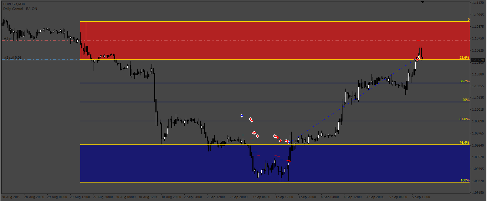
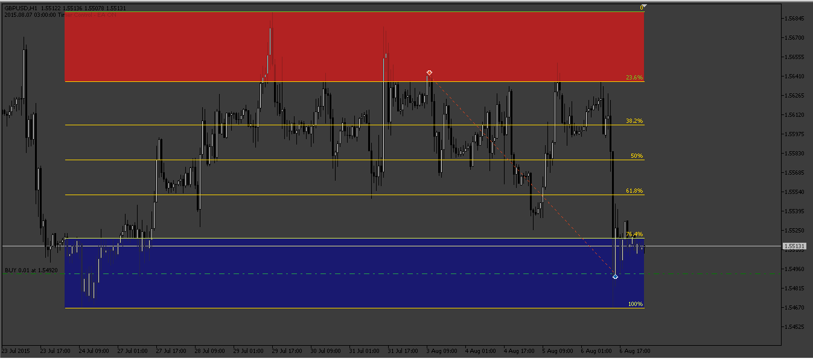

# FiboRetracement EA

> Source: https://fxcodebase.com/code/viewtopic.php?f=38&t=73052  
> Forum: 38 · Topic 73052 · 7 post(s)

---

## FiboRetracement EA

**Apprentice** · Fri Dec 16, 2022 10:50 am

Based on the request.
[https://fxcodebase.com/code/viewtopic.php?f=27&p=148592](https://fxcodebase.com/code/viewtopic.php?f=27&p=148592)

 [TradeZones.mq4](files/148694/TradeZones.mq4)

 [FiboRetracement EA.mq4](files/148694/FiboRetracement%20EA.mq4)

 

 [TradeZones.mq5](files/148694/TradeZones.mq5)

 [FiboRetracement EA.mq5](files/148694/FiboRetracement%20EA.mq5)

---

## Re: FiboRetracement EA

**wems007** · Fri Dec 16, 2022 10:29 pm

MT5 Version Please. Thanks

---

## Re: FiboRetracement EA

**Apprentice** · Sun Dec 18, 2022 3:56 am

We have added your request to the development list.
Development reference 841.

---

## Re: FiboRetracement EA

**Sensible** · Sun Dec 18, 2022 3:32 pm

Hi Apprentice and the team of FxcodeBase

I really appreciate work done on this EA But I have few corrections on this EA

Firstly, I tried to test the EA on strategy Tester on Mt4 and it not taking any Open trade. help me to fix this.

Secondly, I said I want to trade Reversal at 0% and 100% at TradeZone just as I indicate on the diagram below not retracement at 23.6% and 76.4%. Please help me correct this too.

Thanks

---

## Re: FiboRetracement EA

**Apprentice** · Thu Dec 22, 2022 9:37 am

We have added your request to the development list.
Development reference 850.

---

## Re: FiboRetracement EA

**Apprentice** · Thu Dec 22, 2022 11:02 am

MT5 version addded.

---

## Re: FiboRetracement EA

**Apprentice** · Wed Dec 28, 2022 12:16 pm

Try to redownload FiboRetracement EA.mq4
