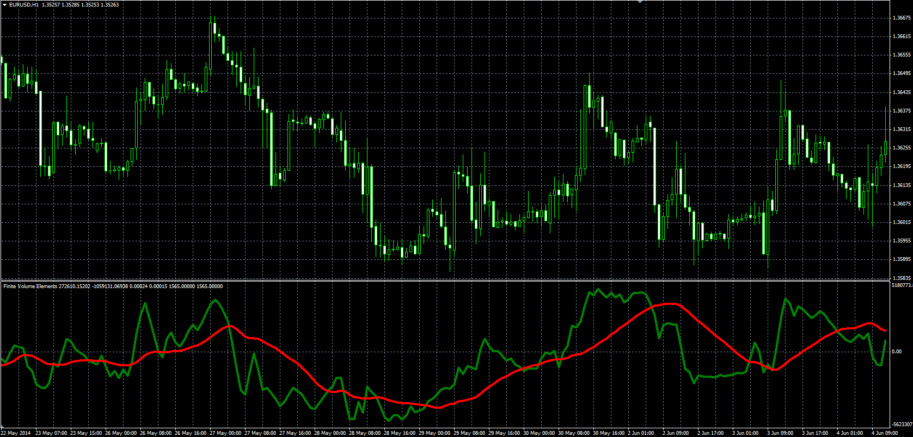
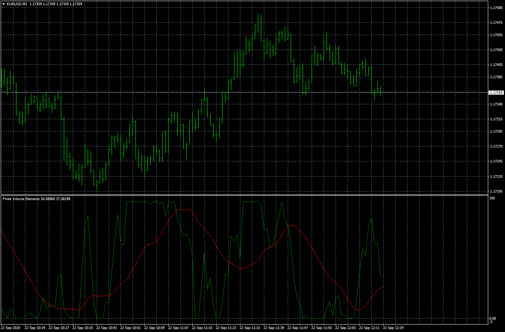

# Finite Volume Elements

> Source: https://fxcodebase.com/code/viewtopic.php?f=38&t=61060  
> Forum: 38 · Topic 61060 · 12 post(s)

---

## Finite Volume Elements

**Alexander.Gettinger** · Wed Aug 20, 2014 10:08 am

Original LUA oscillator: [viewtopic.php?f=17&t=27510](https://fxcodebase.com/code/viewtopic.php?f=17&t=27510).

 

Download:

 [FVE.mq4](files/95448/FVE.mq4)

 

 [Normalized FVE.mq4](files/95448/Normalized%20FVE.mq4)

---

## Re: Finite Volume Elements

**alienfriend18** · Tue Sep 08, 2020 11:46 am

Please add multipair and MTF options
Thanks

---

## Re: Finite Volume Elements

**Apprentice** · Wed Sep 09, 2020 2:04 am

Your request is added to the development list.
Development reference 1998.

---

## Re: Finite Volume Elements

**Apprentice** · Thu Sep 10, 2020 1:58 am

[FVE_MTF.mq4](files/137500/FVE_MTF.mq4)

Try this version.

---

## Re: Finite Volume Elements

**alienfriend18** · Thu Sep 10, 2020 4:12 am

no multi-pair option

---

## Re: Finite Volume Elements

**Apprentice** · Fri Sep 11, 2020 2:47 am

Do you maybe need a dashboard presentation?

---

## Re: Finite Volume Elements

**alienfriend18** · Fri Sep 11, 2020 4:16 am

no dashboard needed. But should have the option to change symbols

---

## Re: Finite Volume Elements

**Apprentice** · Sat Sep 12, 2020 8:42 am

Your request is added to the development list.
Development reference 2020.

---

## Re: Finite Volume Elements

**Apprentice** · Tue Sep 15, 2020 8:15 am

[FVE_MTF.mq4](files/137624/FVE_MTF.mq4)

Try this version.

---

## Re: Finite Volume Elements

**PURABI** · Sat Sep 19, 2020 5:17 am

Please normalize FVE indicator in the scale of 0-100.
fixed minimum= -6000 and fixed maximum= 6000

---

## Re: Finite Volume Elements

**Apprentice** · Sun Sep 20, 2020 5:17 am

Your request is added to the development list.
Development reference 2067.

---

## Re: Finite Volume Elements

**Apprentice** · Tue Sep 22, 2020 4:20 am

Normalized FVE.mq4 added.
