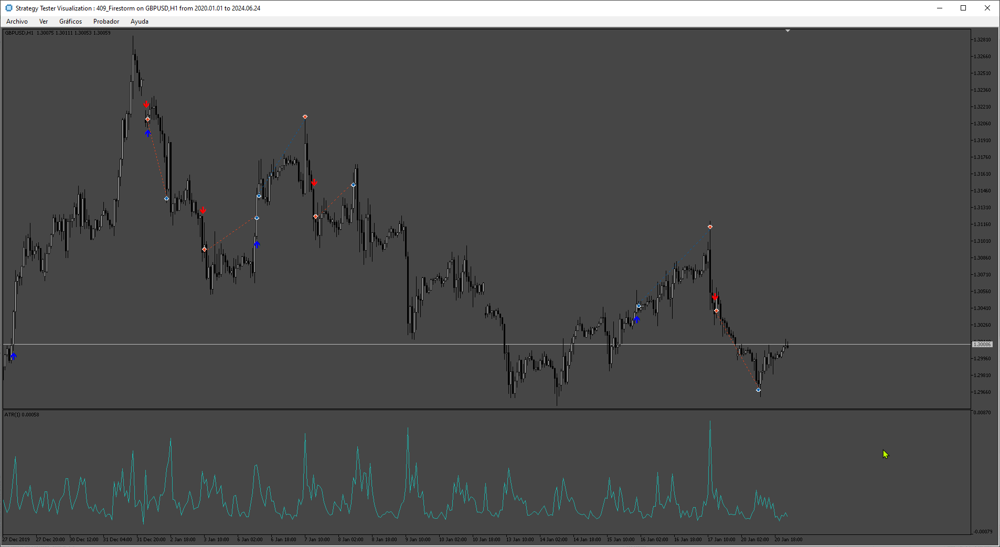
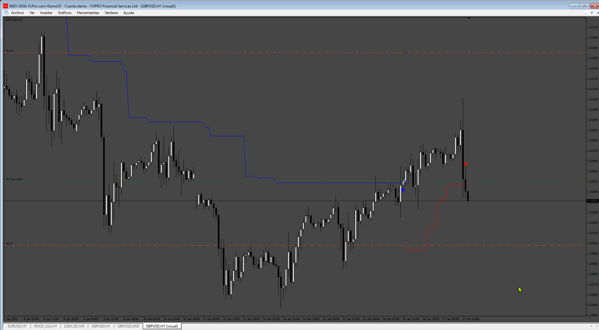

# Firestorm_EA

> Source: https://fxcodebase.com/code/viewtopic.php?f=38&t=75043  
> Forum: 38 · Topic 75043 · 5 post(s)

---

## Firestorm_EA

**Apprentice** · Mon Jul 08, 2024 2:12 pm

Based on the request.
[https://fxcodebase.com/code/viewtopic.php?f=38&t=74889](https://fxcodebase.com/code/viewtopic.php?f=38&t=74889)

 [Firestorm_indicator.mq5](files/156060/Firestorm_indicator.mq5)

 [Firestorm_EA.mq5](files/156060/Firestorm_EA.mq5)

---

## Re: Firestorm_EA

**trtrader** · Mon Jul 08, 2024 2:48 pm

Could you please create mq4 as well?

---

## Re: Firestorm_EA

**Apprentice** · Sat Jul 13, 2024 2:04 am

We have added your request to the development list.
Development reference 567

---

## Re: Firestorm_EA

**Apprentice** · Sat Aug 10, 2024 8:02 pm

 

 [Firestorm.mq4](files/156389/Firestorm.mq4)

 [Firestorm_EA_mt4.mq4](files/156389/Firestorm_EA_mt4.mq4)

---

## Re: Firestorm_EA

**ZeroMenthol** · Mon Aug 12, 2024 9:14 pm

how to tell if the EA is history reader on MT4? this EA gives impressive results on back tests on Mt4 strategy tester, but fails on live or demo accounts
