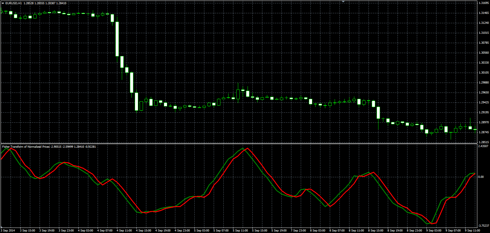

# Fisher Transform of Normalized Prices

> Source: https://fxcodebase.com/code/viewtopic.php?f=38&t=61213  
> Forum: 38 · Topic 61213 · 1 post(s)

---

## Fisher Transform of Normalized Prices

**Alexander.Gettinger** · Mon Sep 22, 2014 9:39 am

Original LUA oscillator: [viewtopic.php?f=17&t=28097](https://fxcodebase.com/code/viewtopic.php?f=17&t=28097).

Formulas:
Fisher[i] = 0.5*(Log((1+V[i])/(1-V[i]))+Fisher[i-1]),
Trigger[i] = Fisher[i-1], where
V[i] = (2/3)*((Price[i]-MinPr)/(MaxPr-MinPr)-0.5+V[i-1]),
MinPr, MaxPr - minimum and maximum prices at range from (i-Lenght+1) to (i),
Log - natural logarithm.

 

Download:

 [FTNP.mq4](files/96070/FTNP.mq4)
