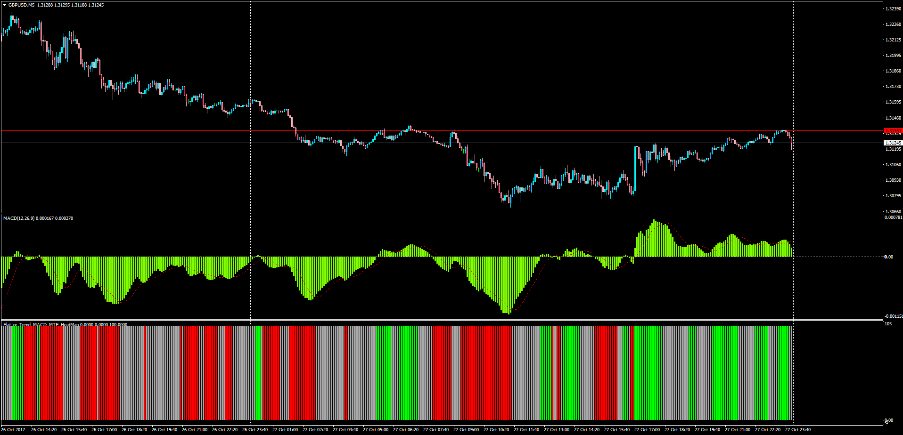
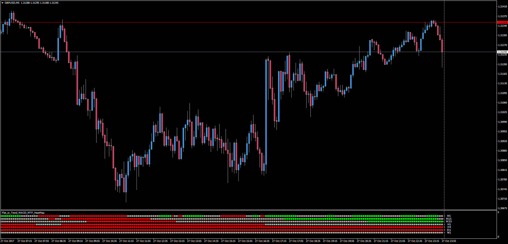

# Flat or Trend MACD MTF Heatmap

> Source: https://fxcodebase.com/code/viewtopic.php?f=38&t=65314  
> Forum: 38 · Topic 65314 · 1 post(s)

---

## Flat or Trend MACD MTF Heatmap

**Apprentice** · Sun Oct 29, 2017 5:11 am

 [Flat_or_Trend_MACD.mq4](files/115740/Flat_or_Trend_MACD.mq4)

 

LUA Original: [viewtopic.php?f=17&t=1719](https://fxcodebase.com/code/viewtopic.php?f=17&t=1719)

Description:

This is the MTF version of the LUA Original Heatmap to view whether a currency pair in a determined pair is trending or is flat according to the MACD, the Signal and the Zero Line:

if SignalMACD<MACD and MACD>0 then indicator show up trend,
if SignalMACD>MACD and MACD<0 then indicator show down trend
else indicator show flat.

 [Flat_or_Trend_MACD_MTF_Heatmap.mq4](files/115740/Flat_or_Trend_MACD_MTF_Heatmap.mq4)
