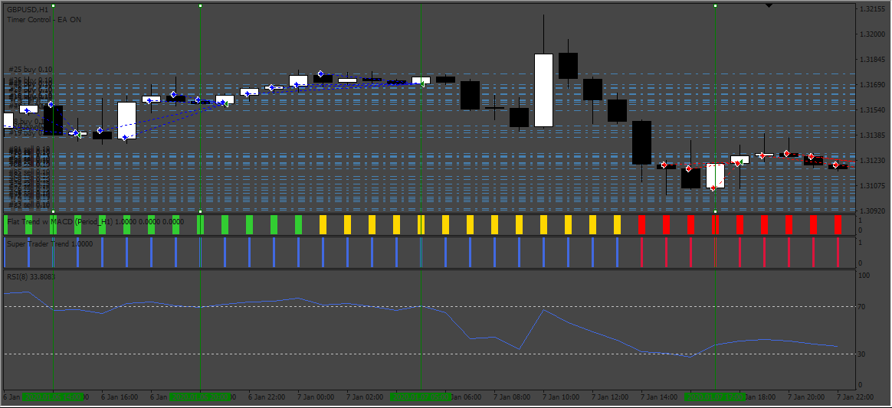
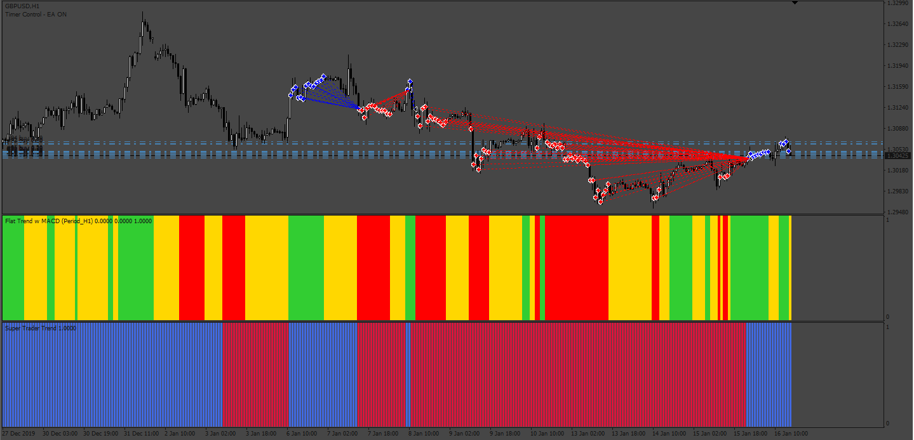
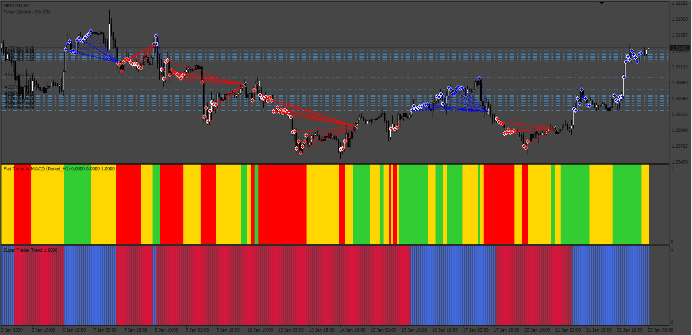
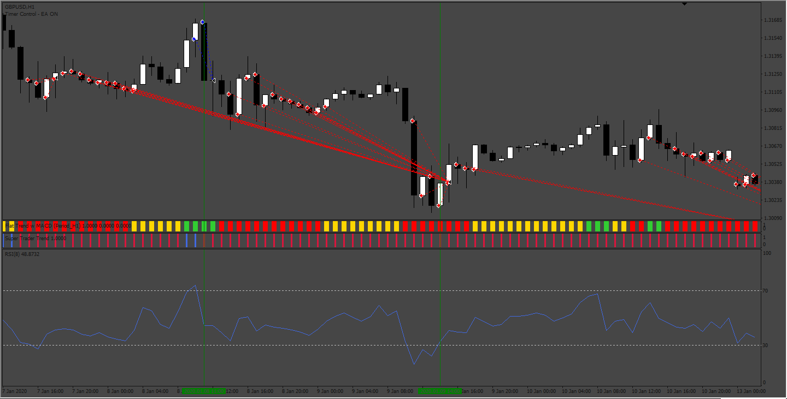
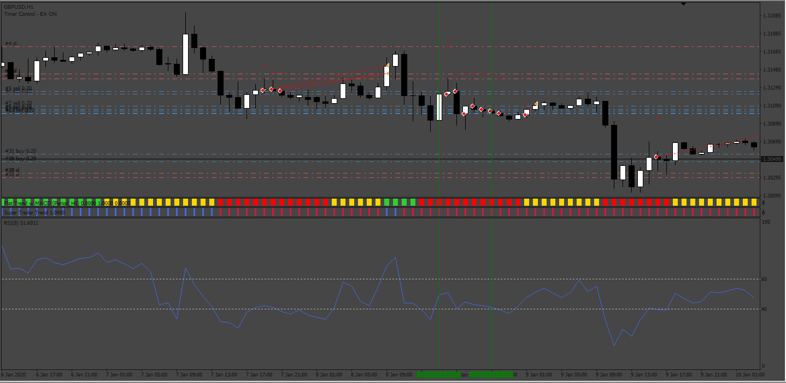
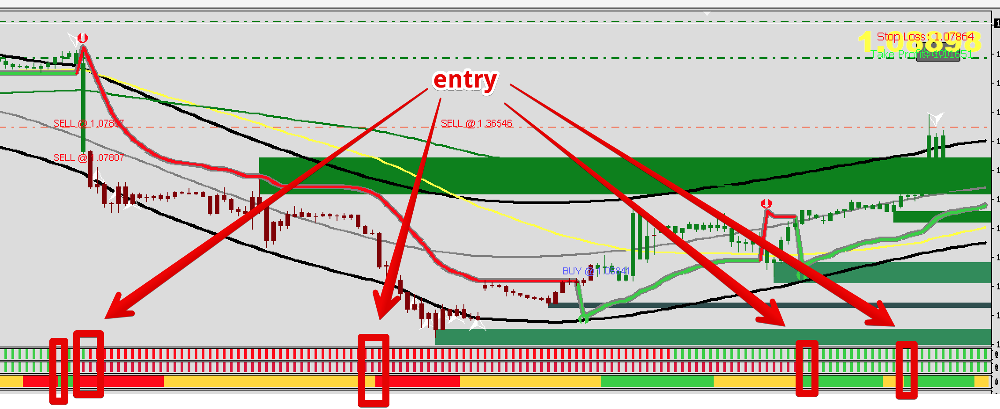
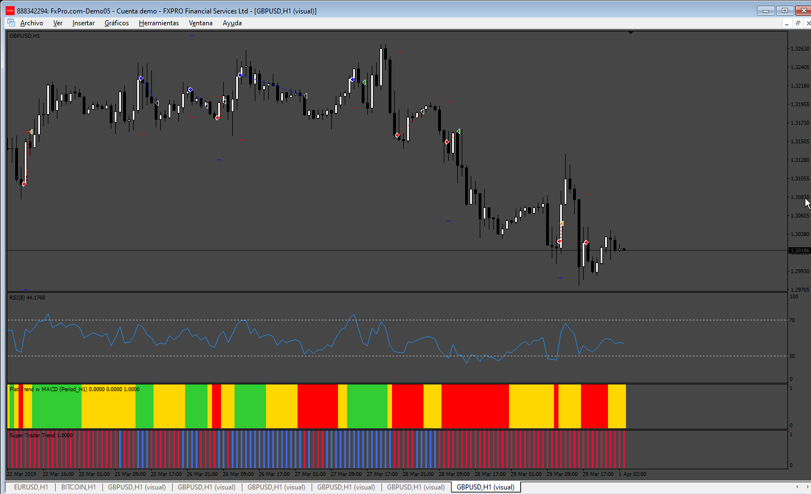

# Flat_Trend_EA

> Source: https://fxcodebase.com/code/viewtopic.php?f=38&t=74931  
> Forum: 38 · Topic 74931 · 12 post(s)

---

## Flat_Trend_EA

**Apprentice** · Thu May 30, 2024 2:34 pm

Based on the request.
[https://fxcodebase.com/code/viewtopic.p ... 59#p155459](https://fxcodebase.com/code/viewtopic.php?f=27&p=155459#p155459)

 

 

 

 

 

 [FlatTrend_w_MACD_alertsfix_(1).mq4](files/155579/FlatTrend_w_MACD_alertsfix_%281%29.mq4)

 [Flat_Trend_EA.mq4](files/155579/Flat_Trend_EA.mq4)

 [SuperTraderTrend.ex4](files/155579/SuperTraderTrend.ex4)

---

## Re: Flat_Trend_EA

**trtrader** · Thu May 30, 2024 3:21 pm

Could you please add an option to EA open only 1 order until the next signal from Flat trend indicator?

 

---

## Re: Flat_Trend_EA

**Apprentice** · Sun Jun 02, 2024 2:35 pm

We have added your request to the development list.
Development reference 456

---

## Re: Flat_Trend_EA

**trtrader** · Wed Jun 05, 2024 11:11 pm

Also for extra and optional confirmation, could you please add the attached indicator as filter?

As soon as all 3 indicators show the same colour, we enter the trade.

 

---

## Re: Flat_Trend_EA

**Apprentice** · Wed Jun 12, 2024 2:38 pm

 [Flat_Trend_EA.mq4](files/155738/Flat_Trend_EA.mq4)

---

## Re: Flat_Trend_EA

**trtrader** · Wed Jun 12, 2024 3:47 pm

Could you please add this as well with true, false options?

> **trtrader wrote:**
> Also for extra and optional confirmation, could you please add the attached indicator as filter?
>
> As soon as all 3 indicators show the same colour, we enter the trade.
>
>
>
>
> enytt.png

---

## Re: Flat_Trend_EA

**Apprentice** · Sun Jun 16, 2024 9:50 am

We have added your request to the development list.
Development reference 508

---

## Re: Flat_Trend_EA

**Apprentice** · Tue Jun 25, 2024 1:03 pm

[Flat_Trend_EA.mq4](files/155921/Flat_Trend_EA.mq4)

Try this version.

---

## Re: Flat_Trend_EA

**trtrader** · Tue Jun 25, 2024 9:58 pm

Sorry but I still dont see this done.

 

---

## Re: Flat_Trend_EA

**trtrader** · Mon Jul 29, 2024 7:49 am

> **trtrader wrote:**
> Sorry but I still dont see this done.
>
>
>
> enytt (1).png

Any update on this? thanks

---

## Re: Flat_Trend_EA

**Apprentice** · Wed Jul 31, 2024 3:33 pm

We have added your request to the development list.
Development reference 624

---

## Re: Flat_Trend_EA

**Apprentice** · Tue Aug 06, 2024 3:24 pm

[!!supertrend_-_cci_histo_(mtf_+_arrows_+_alerts).ex4](files/156338/supertrend_-_cci_histo_%28mtf__arrows__alerts%29.ex4)

 [Flat_Trend_EA_v2.mq4](files/156338/Flat_Trend_EA_v2.mq4)

It is important for the indicator to have exactly this file name as I attached; otherwise, it will
continuously send alerts.
