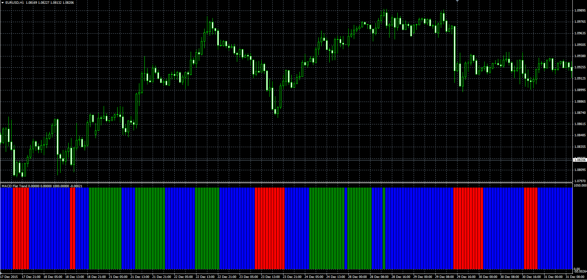

# Flat/Trend MACD indicator

> Source: https://fxcodebase.com/code/viewtopic.php?f=38&t=63068  
> Forum: 38 · Topic 63068 · 1 post(s)

---

## Flat/Trend MACD indicator

**Alexander.Gettinger** · Mon Jan 25, 2016 10:07 am

The indicator formula is
if SignalMACD<MACD and MACD>0 then indicator show up trend,
if SignalMACD>MACD and MACD<0 then indicator show down trend
else indicator show flat.

 

Download:

 [MACD_Flat_Trend.mq4](files/104423/MACD_Flat_Trend.mq4)
