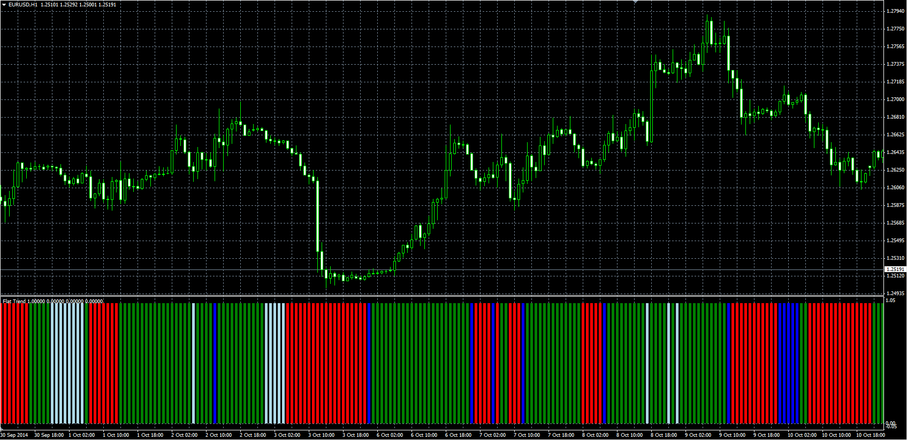

# Flat Trend oscillator

> Source: https://fxcodebase.com/code/viewtopic.php?f=38&t=61473  
> Forum: 38 · Topic 61473 · 1 post(s)

---

## Flat Trend oscillator

**Alexander.Gettinger** · Tue Nov 18, 2014 4:53 pm

Original LUA oscillator: [viewtopic.php?f=17&t=15472](https://fxcodebase.com/code/viewtopic.php?f=17&t=15472).

> Overlay uses two filters.
> SAR & DMI.
> If both are positive, we have the up trend.
> If both are negative, we have a down trend.

 

Download:

 [Flat_Trend.mq4](files/97174/Flat_Trend.mq4)
