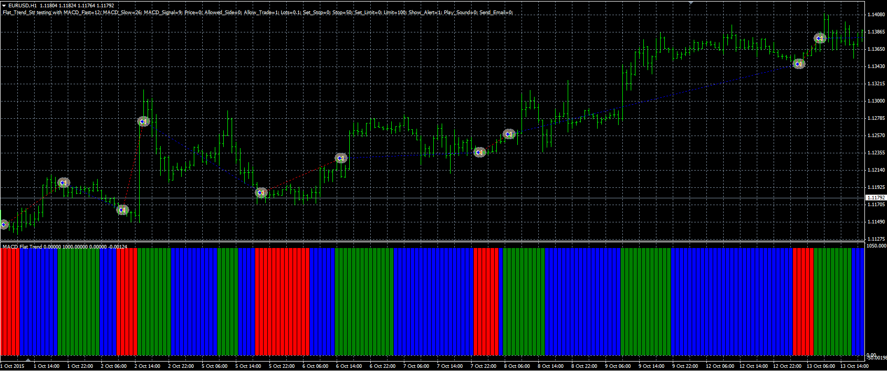

# Flat/Trend strategy

> Source: https://fxcodebase.com/code/viewtopic.php?f=38&t=63300  
> Forum: 38 · Topic 63300 · 1 post(s)

---

## Flat/Trend strategy

**Alexander.Gettinger** · Fri Mar 25, 2016 4:44 pm

The strategy based on Flat/Trend MACD indicator ([viewtopic.php?f=38&t=63068&p=104423](https://fxcodebase.com/code/viewtopic.php?f=38&t=63068&p=104423)).

Buy condition: Buy signal (Green) of indicator.
Sell condition: Sell signal (Red) of indicator.

 

Download:

 [Flat_Trend_Str.mq4](files/105479/Flat_Trend_Str.mq4)

The Flat/Trend MACD indicator ([viewtopic.php?f=38&t=63068&p=104423](https://fxcodebase.com/code/viewtopic.php?f=38&t=63068&p=104423)) should be installed for correct work.
