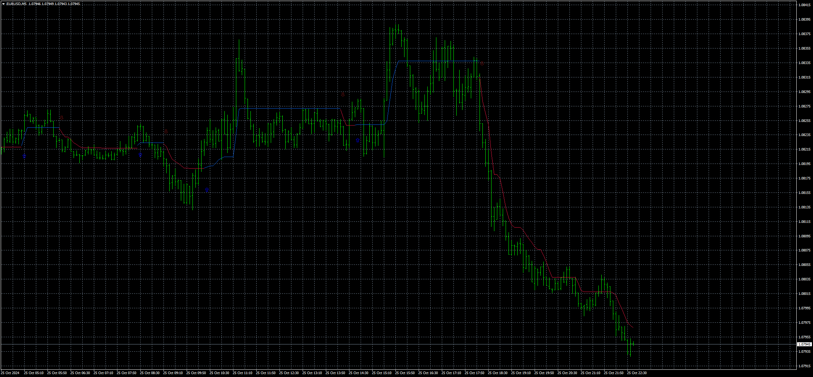
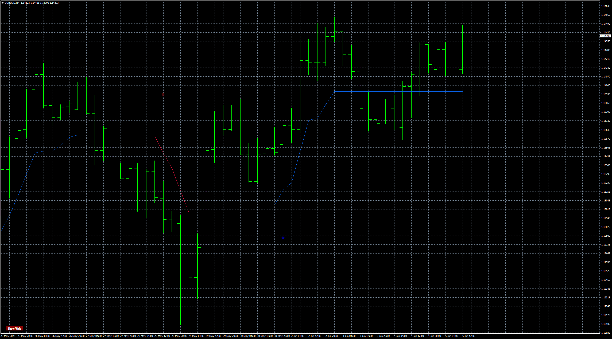

# Follow Line

> Source: https://fxcodebase.com/code/viewtopic.php?f=38&t=75307  
> Forum: 38 · Topic 75307 · 11 post(s)

---

## Follow Line

**Apprentice** · Fri Oct 25, 2024 2:53 pm

Based on the code.
[https://www.tradingview.com/script/UXKo4RaJ/](https://www.tradingview.com/script/UXKo4RaJ/)

 [Follow Line.mq4](files/157073/Follow%20Line.mq4)

 [Follow Line.mq5](files/157073/Follow%20Line.mq5)

TS2 version.
[https://fxcodebase.com/code/viewtopic.php?f=17&t=75315](https://fxcodebase.com/code/viewtopic.php?f=17&t=75315)

---

## Re: Follow Line

**Teruyoshi** · Sat Oct 26, 2024 12:21 pm

Thanks for sharing wonderful indicator！
Yet, there is already the same indicator as this one but it does'n't have mtf function and on-off button. Also, it wound be of help if we can decide arrow distances to make charts cleaner.
Would you modify when it is convenient for you?

---

## Re: Follow Line

**Apprentice** · Thu Oct 31, 2024 8:37 am

We have added your request to the development list.
Development reference 812

---

## Re: Follow Line

**Apprentice** · Wed Jan 15, 2025 4:58 am

[Follow_Line.mq4](files/157817/Follow_Line.mq4)

I’ve added an on/off button for the MT4.
I don’t have snippets for MT5 yet (it’ll take time to develop it).
It’ll take some time to figure out why it crashes.

---

## Re: Follow Line

**Teruyoshi** · Thu Jan 16, 2025 5:53 am

Thanks. Teacher Apprentice
I am afraid to say this doesn't seem to have mtf function.
Could it be equipped?

---

## Re: Follow Line

**Teruyoshi** · Fri Apr 25, 2025 9:38 am

Hi, Teacher Apprentice,
 How is it going about the request above?
I am waiting for follow line with mtf function to come.
 Many thanks in advence.

---

## Re: Follow Line

**Apprentice** · Sat Apr 26, 2025 3:21 pm

We have added your request to the development list.
Development reference 285

---

## Re: Follow Line

**Apprentice** · Wed May 07, 2025 11:48 am

[Follow_Line_v3.mq4](files/159151/Follow_Line_v3.mq4)

 [Follow_Line_v3.mq5](files/159151/Follow_Line_v3.mq5)

---

## Re: Follow Line

**Teruyoshi** · Thu May 08, 2025 5:19 am

Thanks for updating but I'm afraid to say I want to select ma type other than sma such as ema , lwma and so on.
 Could you fix it?

---

## Re: Follow Line

**Apprentice** · Sun May 11, 2025 2:40 pm

We have added your request to the development list.
Development reference 323

---

## Re: Follow Line

**Apprentice** · Thu Jun 05, 2025 7:40 am

 [Follow_Line.mq4](files/159476/Follow_Line.mq4)

 [Follow_Line.mq5](files/159476/Follow_Line.mq5)
