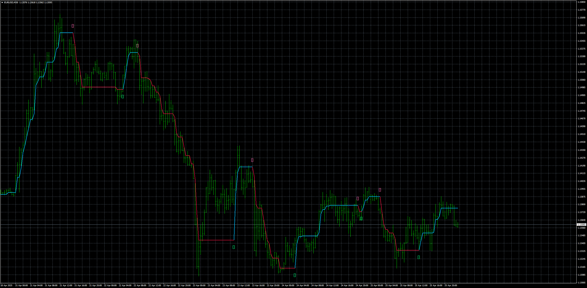
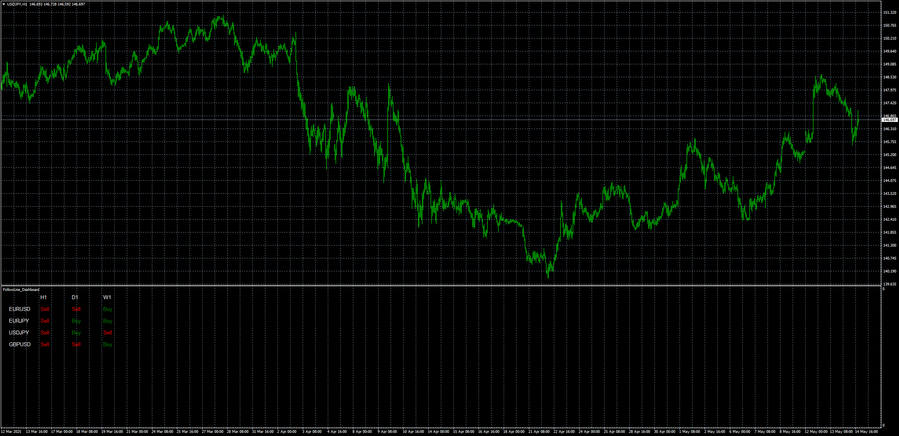

# FollowLine

> Source: https://fxcodebase.com/code/viewtopic.php?f=38&t=75862  
> Forum: 38 · Topic 75862 · 5 post(s)

---

## FollowLine

**Apprentice** · Sat Apr 26, 2025 2:52 pm

Based on the request.
[https://fxcodebase.com/code/viewtopic.p ... 83#p158983](https://fxcodebase.com/code/viewtopic.php?f=27&p=158983#p158983)

 [FollowLine.mq4](files/159044/FollowLine.mq4)

---

## Re: FollowLine

**Teruyoshi** · Fri May 02, 2025 10:49 pm

Teacher Apprentice, would you mind turning this into scanner indicator so that we can watch all time frame when you have time?
 Many many thanks in advance.

---

## Re: FollowLine

**Apprentice** · Wed May 07, 2025 12:30 pm

We have added your request to the development list.
Development reference 312

---

## Re: FollowLine

**Teruyoshi** · Tue May 13, 2025 5:10 am

I forget to say I want a scanner type indicator like one ([https://fxcodebase.com/code/viewtopic.php?f=38&t=75500](https://fxcodebase.com/code/viewtopic.php?f=38&t=75500)) so that I can watch time frames as I want.
 Thanks a million.

---

## Re: FollowLine

**Apprentice** · Wed May 14, 2025 12:12 pm

 [FollowLine_Dashboard.mq4](files/159234/FollowLine_Dashboard.mq4)
