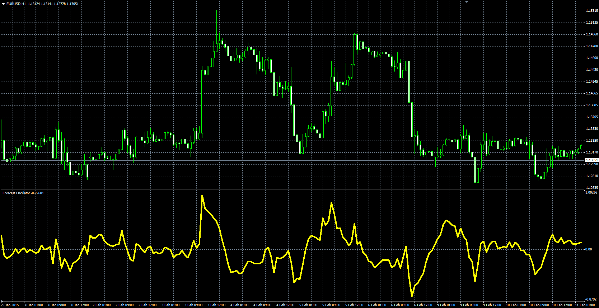

# Forecast oscillator

> Source: https://fxcodebase.com/code/viewtopic.php?f=38&t=61847  
> Forum: 38 · Topic 61847 · 1 post(s)

---

## Forecast oscillator

**Alexander.Gettinger** · Fri Feb 20, 2015 5:25 pm

Original LUA oscillator: [viewtopic.php?f=17&t=693](https://fxcodebase.com/code/viewtopic.php?f=17&t=693).

> The forecast oscillator is developed by by Tushar Chande and is an extension of the Time Frame Forecast method.
>
> The formula is:
> Forecast Oscillator = Price - Previous Time Series Forecast / Price * 100
>
> Interpretation:
> The positive value of the indicator forecasts higher prices. The negative value forecasts the lower prices. Chande also recommends to user 3-day smoothing line as a trigger. When the oscillator falls below or crosses above the trigger line it shows a change of the trend.

 

Download:

 [forecast.mq4](files/98762/forecast.mq4)
