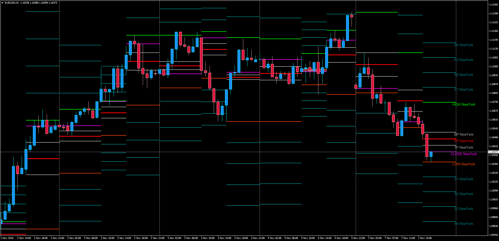

# Forex Sessions Pivot Extensions

> Source: https://fxcodebase.com/code/viewtopic.php?f=38&t=64072  
> Forum: 38 · Topic 64072 · 1 post(s)

---

## Forex Sessions Pivot Extensions

**Apprentice** · Tue Nov 08, 2016 5:00 am

Based on.
[viewtopic.php?f=38&t=63867](https://fxcodebase.com/code/viewtopic.php?f=38&t=63867)
Description:
This is a custom modification of the Pivot Extensions concept to plot pivots on each session that are calculated with the High/Low/Close of the Previous Session.

Trading Sessions in GMT are defined like this:

Sidney: 21:00 to 05:00
Tokyo: 23:00 to 07:00
Frankfurt: 07:00 to 15:00
London: 08:00 to 16:00
New York: 13:00 to 21:00

Simplifying:

Asia: 21:00 to 07:00 (10 hours)
Europe: 07:00 to 16:00 (9 hours)
New York: 13:00 to 21:00 (8 hours)

From there, the trader needs to check where the Asian session begins. For instance, if the Asian session in the MT4 chart starts at 00:00, the indicator times are like this:

Asia Session Start = 0
Asia Session End = 10
Europe Session Start = 10
Europe Session End = 19
New York Session Start = 16
New YOrk Session End = 0

Each session pivots are placed at the Start Hour of each session calculated with the High/Low/Close values of the previous session. If that previous session is still running (in real time) then the pivots will equally be placed but having the previous session still active until it finally closes (session overlap hours).

It works with H1 Charts and lower and it requires all candles to be present in historical data for the choosen number of days in order to work.

 [FXSessionsPivotsExtensions.mq4](files/108969/FXSessionsPivotsExtensions.mq4)
