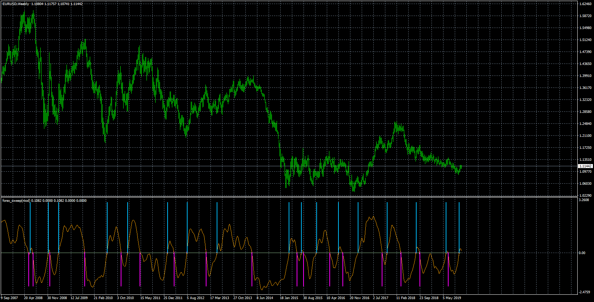
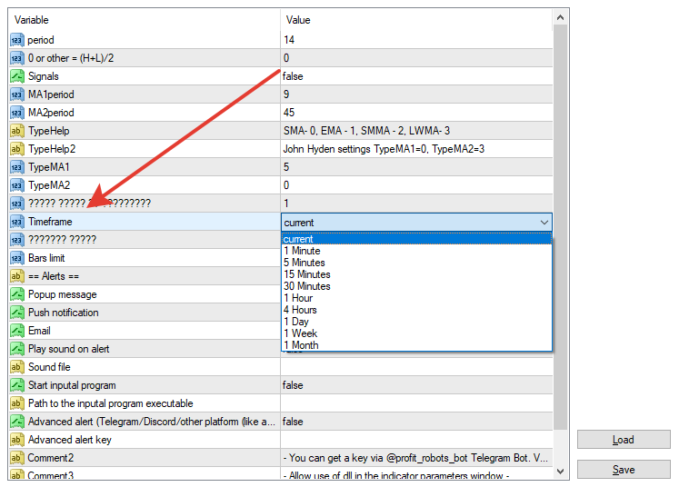
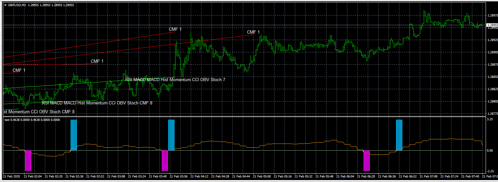

# forex_sweep(mod)

> Source: https://fxcodebase.com/code/viewtopic.php?f=38&t=69295  
> Forum: 38 · Topic 69295 · 15 post(s)

---

## forex_sweep(mod)

**Apprentice** · Mon Jan 06, 2020 8:48 am

Based on request.
[viewtopic.php?f=38&t=69281](https://fxcodebase.com/code/viewtopic.php?f=38&t=69281)

 [forex_sweep(mod).mq4](files/130600/forex_sweep%28mod%29.mq4)

---

## Re: forex_sweep(mod)

**ibadejumo** · Mon Jan 06, 2020 9:11 am

Thanks alot. i will check it and let you know.

---

## Re: forex_sweep(mod)

**ibadejumo** · Mon Jan 06, 2020 3:20 pm

I have checked the indicator and i noticed the following;

1. It does not follow price action on live trading, except I refresh the chart and it will catch up with price.
2. It only gives alert on MT4 but I haven't received e-mail alert.
3. Can you add option to select higher and lower time frame?

Thank you.

---

## Re: forex_sweep(mod)

**Apprentice** · Tue Jan 07, 2020 8:30 am

Your request is added to the development list.
Development reference 526.

---

## Re: forex_sweep(mod)

**Apprentice** · Wed Jan 08, 2020 6:34 am

You will need to re-download.
To get emails you need to enable emails in the indicator options

---

## Re: forex_sweep(mod)

**ibadejumo** · Mon Jan 13, 2020 6:45 am

Hello,

I have re-downloaded it and enabled e-mails in the option (like I did before) but see my observations below;

1. Thank you, the indicator is no more lagging.
2. I didn't receive an e-mail alert on the M1 chart like other indicators.
3. When I changed the chart to M15 and change the timeframe to a higher time frame like H1, it was sending e-mail alerts but the indicator was all blank. I could not see it again unless I changed it back to the current timeframe then it will show but with no e-mail alerts.

Thanking you for your help

---

## Re: forex_sweep(mod)

**Apprentice** · Thu Jan 16, 2020 4:44 am

I did throw out the previous implementation and recode it from scratch.

 [forex_sweep(mod).mq4](files/130751/forex_sweep%28mod%29.mq4)

---

## Re: forex_sweep(mod)

**ibadejumo** · Thu Jan 23, 2020 3:56 am

Thanks for your help.
But i noticed it is not giving exact signal like the original indicator I uploaded initially.
I have attached the initial indicator again so that you can also compare both.
You must use the same 'period' settings for better comparison.
Thanking you once again.

---

## Re: forex_sweep(mod)

**Apprentice** · Thu Jan 23, 2020 11:44 am

Your request is added to the development list.
Development reference 581.

---

## Re: forex_sweep(mod)

**Apprentice** · Fri Jan 24, 2020 6:39 am

he original indicator has some bugs. I forced to rewrite it from scratch in order to add new features. There is no other way of adding new features you have requested. These bugs in the old code make it impossible to add these features. Unfortunately, there is nothing we can do with it.

---

## Re: forex_sweep(mod)

**idreezz** · Tue Feb 11, 2020 4:22 am

thanks Apprentice,

Can you kindly add the higher time frame selection to the new code you have written?

Thank you as always.

---

## Re: forex_sweep(mod)

**Apprentice** · Tue Feb 11, 2020 6:03 am

Your request is added to the development list.
Development reference 711.

---

## Re: forex_sweep(mod)

**Apprentice** · Wed Feb 12, 2020 1:29 pm

Already has it.

---

## Re: forex_sweep(mod)

**idreezz** · Tue Feb 18, 2020 9:45 am

> **Apprentice wrote:**
>
>
> The attachment **image.png** is no longer available
>
>
> Already has it.

Thank you for this.

I selected 5mins as the higher time frame and the indicator did not display as shown in the picture.

It does that ones the higher timeframe is selected.

Can you please rectify?

---

## Re: forex_sweep(mod)

**Apprentice** · Fri Feb 21, 2020 6:28 am

I don't have any issues. It's likely you have no m5 data downloaded
