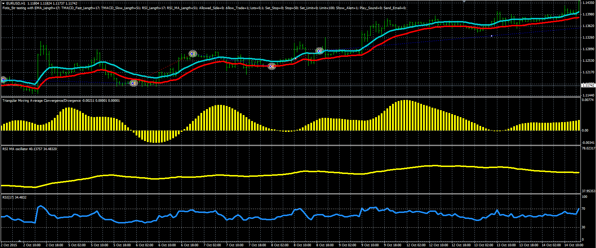

# Fotis Strategy

> Source: https://fxcodebase.com/code/viewtopic.php?f=38&t=63303  
> Forum: 38 · Topic 63303 · 1 post(s)

---

## Fotis Strategy

**Alexander.Gettinger** · Fri Mar 25, 2016 5:18 pm

The strategy based on the several indicators: RSI, MA and TMACD.

Buy condition: TMACD>0 and RSI>MA(RSI) and Price>EMA(High) and Up last candle.
Sell condition: TMACD<0 and RSI<MA(RSI) and Price<EMA(Low) and Down last candle.

 

Download:

 [Fotis_Str.mq4](files/105482/Fotis_Str.mq4)

The RSI_MA indicator ([viewtopic.php?f=38&t=63302](https://fxcodebase.com/code/viewtopic.php?f=38&t=63302)) and the TMACD oscillator ([viewtopic.php?f=38&t=63202&p=105065](https://fxcodebase.com/code/viewtopic.php?f=38&t=63202&p=105065)) should be installed for correct work.
