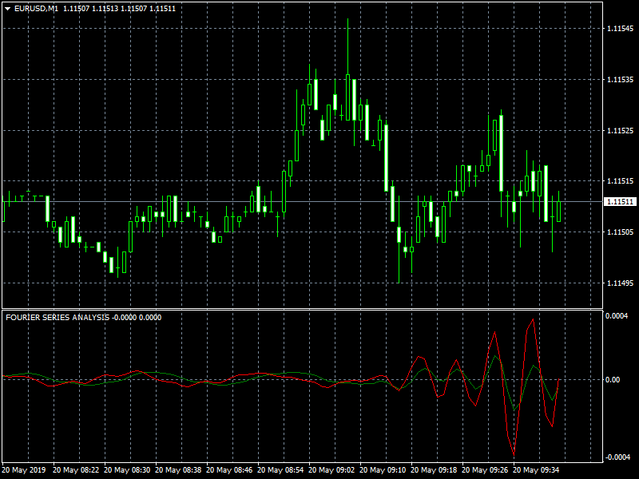

# FOURIER SERIES ANALYSIS

> Source: https://fxcodebase.com/code/viewtopic.php?f=38&t=68478  
> Forum: 38 · Topic 68478 · 1 post(s)

---

## FOURIER SERIES ANALYSIS

**Apprentice** · Mon May 20, 2019 3:37 am

Based on Lua/TS2 version.
[viewtopic.php?f=17&t=68456](https://fxcodebase.com/code/viewtopic.php?f=17&t=68456)
Based on the article Harmonic Synchronicity: Fourier Series Model Of The Market by John F. Ehlers • June 2019 • Technical Analysis of StockS & commoditieS

 [FOURIER SERIES ANALYSIS.mq4](files/126423/FOURIER%20SERIES%20ANALYSIS.mq4)
