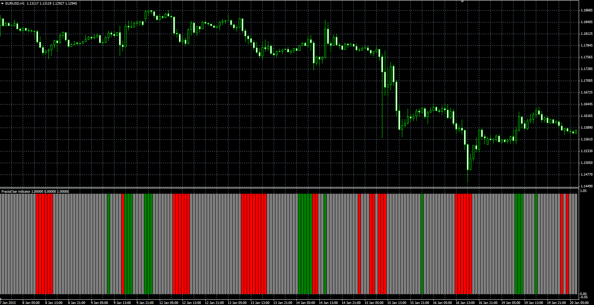
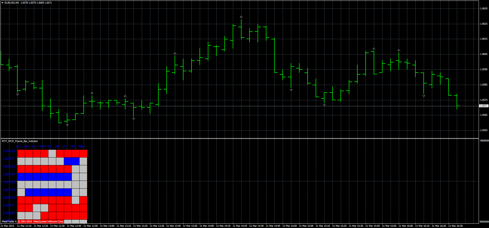

# Fractal Bar indicator

> Source: https://fxcodebase.com/code/viewtopic.php?f=38&t=61980  
> Forum: 38 · Topic 61980 · 7 post(s)

---

## Fractal Bar indicator

**Alexander.Gettinger** · Mon Mar 09, 2015 3:50 pm

Original LUA indicator: [viewtopic.php?f=17&t=61341](https://fxcodebase.com/code/viewtopic.php?f=17&t=61341).

 

Download:

 [Fractal_Bar_Indicator.mq4](files/99137/Fractal_Bar_Indicator.mq4)

 

 [MTF MCP Fractal_Bar_Indicator.mq4](files/99137/MTF%20MCP%20Fractal_Bar_Indicator.mq4)

---

## Re: Fractal Bar indicator

**tmue2014** · Mon Mar 09, 2015 7:14 pm

thanks Alexander - could you please also code the MTF MCP Fractal Bar Heat Map for Mt4?

(Second indicator in same thread....)

Thanks in advance

---

## Re: Fractal Bar indicator

**Apprentice** · Wed Mar 11, 2015 9:45 am

MTF MCP Fractal_Bar_Indicator.mq4 Added.

---

## Re: Fractal Bar indicator

**tmue2014** · Wed Mar 11, 2015 9:23 pm

Thanks a lot!

---

## Re: Fractal Bar indicator

**Aliraza9** · Thu Apr 02, 2015 12:40 am

However, can I be a pain and ask if it can to modified to sound an alarm and show a msgbx when the last tick makes the Open/Last Price spread equal to the ATR*Multiplier in real time????

---

## Re: Fractal Bar indicator

**Apprentice** · Wed Apr 08, 2015 2:17 am

Your request is added to the development list.

---

## Re: Fractal Bar indicator

**Alexander.Gettinger** · Fri Dec 14, 2018 4:50 pm

Please try this version of indicator:

 [Fractal_Bar_Indicator_with_Alert.mq4](files/122859/Fractal_Bar_Indicator_with_Alert.mq4)
