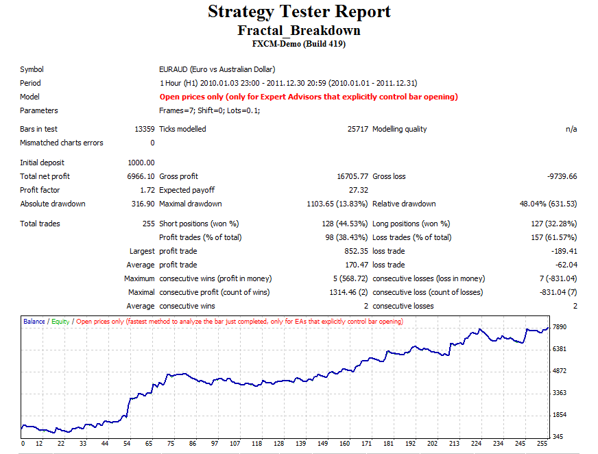

# Fractal breakdown strategy

> Source: https://fxcodebase.com/code/viewtopic.php?f=38&t=17550  
> Forum: 38 · Topic 17550 · 8 post(s)

---

## Fractal breakdown strategy

**Alexander.Gettinger** · Wed May 02, 2012 11:29 am

This strategy uses the Advanced Fractal indicator ([viewtopic.php?f=38&t=17244](https://fxcodebase.com/code/viewtopic.php?f=38&t=17244)).

BUY order opens on new UP fractal and have stop on last DN fractal.
Similarly, for SELL orders.

 

Download:

 [Fractal_Breakdown.mq4](files/31972/Fractal_Breakdown.mq4)

---

## Re: Fractal breakdown strategy

**4x4partners** · Mon May 04, 2015 12:33 pm

Hi,

Does this exist for TS2 ?

Thanks

---

## Re: Fractal breakdown strategy

**Apprentice** · Wed May 06, 2015 8:37 am

Not that I know.

---

## Re: Fractal breakdown strategy

**idude0407** · Tue Jun 23, 2015 5:10 pm

This EA seems to work pretty good on 5 pip wicked renkos but entries should be 1 pip below the fractal for shorts and 2 pip above the fractal for longs.

The stop loss should be 1 below the fractal for longs and 2 pips above the fractal for shorts.

The extra pip accounts for the spread since two entries will be filled by the ask price.

The way it is now is not following Bill Williams recommendations.

Can you make these modifications?

---

## Re: Fractal breakdown strategy

**Apprentice** · Wed Jun 24, 2015 6:40 am

Your request is added to the development list.

---

## Re: Fractal breakdown strategy

**briansummy** · Tue Sep 13, 2016 9:44 am

Any luck with this by chance? I think an EA with fractals would be a very cool EA.

---

## Re: Fractal breakdown strategy

**briansummy** · Tue Sep 13, 2016 1:51 pm

Would it be easily able to incorporate a few additions?

-No Hedging if that's a risk of happening. I will test this all tonight.
-Max position/multiple open positions set value unless already does this.
-Stop loss trailing on previous fractal X bars
- option to input a limit?

I am excited to see if this has opportunity. Williams Youtube channels teaching has sold me on fractal concepts.

---

## Re: Fractal breakdown strategy

**briansummy** · Tue Sep 13, 2016 9:06 pm

Trying to attach this to the chart but it won't work. Help?
