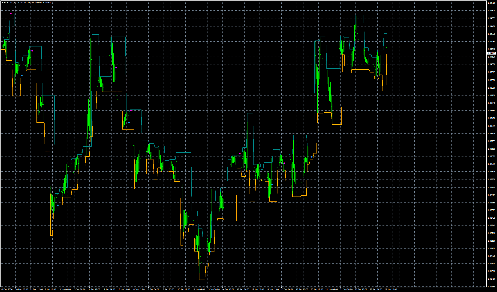
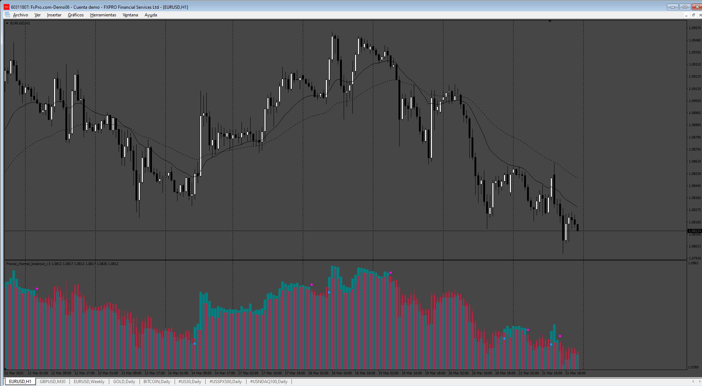

# Fractal_-_channel_breakout

> Source: https://fxcodebase.com/code/viewtopic.php?f=38&t=75535  
> Forum: 38 · Topic 75535 · 5 post(s)

---

## Fractal_-_channel_breakout

**Apprentice** · Thu Jan 23, 2025 3:54 pm

Based on the request.
[https://fxcodebase.com/code/viewtopic.php?f=38&t=75507](https://fxcodebase.com/code/viewtopic.php?f=38&t=75507)

 [Fractal_-_channel_breakout_v2.mq4](files/157970/Fractal_-_channel_breakout_v2.mq4)

---

## Re: Fractal_-_channel_breakout

**Honest_Trader** · Thu Feb 13, 2025 9:22 am

Thanks mate, appreciate your time on this. Will check and update you.

Warm Regards
GK

---

## Re: Fractal_-_channel_breakout

**Teruyoshi** · Fri Mar 21, 2025 3:45 am

Could you make histo version (sub-win) of this when it is convenient for you?
 Many many thanks in advance.

---

## Re: Fractal_-_channel_breakout

**Apprentice** · Fri Mar 21, 2025 5:52 am

We have added your request to the development list.
Development reference 209

---

## Re: Fractal_-_channel_breakout

**Apprentice** · Sun Mar 23, 2025 11:11 am

 [Fractal_channel_breakout_v3.mq4](files/158740/Fractal_channel_breakout_v3.mq4)
