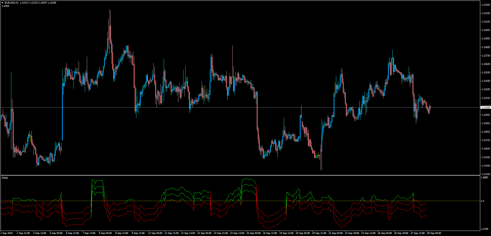

# Fractal Graph Dimension Indicator (FGDI)

> Source: https://fxcodebase.com/code/viewtopic.php?f=38&t=63912  
> Forum: 38 · Topic 63912 · 1 post(s)

---

## Fractal Graph Dimension Indicator (FGDI)

**Apprentice** · Wed Sep 28, 2016 1:57 am

LUA Original: [viewtopic.php?f=17&t=1250](https://fxcodebase.com/code/viewtopic.php?f=17&t=1250)

Description:

The Hurst Difference Oscillator was presented here [viewtopic.php?f=38&t=63898](https://fxcodebase.com/code/viewtopic.php?f=38&t=63898) and uses the FDI within its code, so today here it is the FGDI developed for MT4.

This indicator do not shows trend direction, but it shows the market is in trend or in volatility.

The indicator is described in Technical Analysis of Stocks and Commodities, in a article by Radha Panini, in March, 2007, which is based on Carlos Sevcik, "A procedure to Estimate the Fractal Dimension of Waveforms" article.

 [FGDI.mq4](files/108308/FGDI.mq4)
