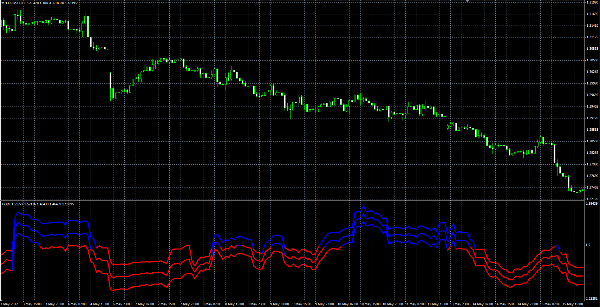

# Fractal Graph Dimension Indicator (FGDI)

> Source: https://fxcodebase.com/code/viewtopic.php?f=38&t=61696  
> Forum: 38 · Topic 61696 · 1 post(s)

---

## Fractal Graph Dimension Indicator (FGDI)

**Alexander.Gettinger** · Fri Jan 09, 2015 4:20 pm

This indicator do not shows trend direction, but it shows the market is in trend or in volatility.

The indicator is described in Technical Analysis of Stocks and Commodities, in a article by Radha Panini, in March, 2007, which is based on Carlos Sevcik, "A procedure to Estimate the Fractal Dimension of Waveforms" article.

 

Download:

 [FGDI.mq4](files/98066/FGDI.mq4)
