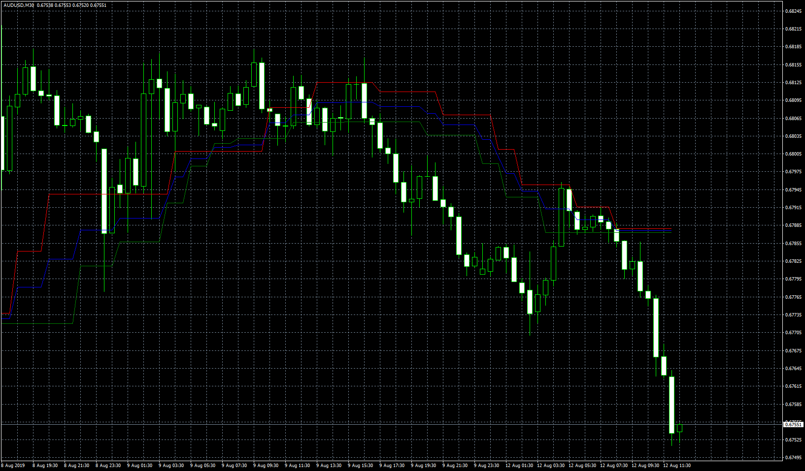

# Fractals average breakout EA

> Source: https://fxcodebase.com/code/viewtopic.php?f=38&t=69899  
> Forum: 38 · Topic 69899 · 5 post(s)

---

## Fractals average breakout EA

**Apprentice** · Fri May 22, 2020 7:28 am

Based on request.
 [viewtopic.php?f=38&t=69890](https://fxcodebase.com/code/viewtopic.php?f=38&t=69890)

 [Fractals average breakout Indicator.mq4](files/134182/Fractals%20average%20breakout%20Indicator.mq4)

 [Fractals average breakout EA.mq4](files/134182/Fractals%20average%20breakout%20EA.mq4)

---

## Re: Fractals average breakout EA

**khai.cao** · Sat May 23, 2020 12:56 pm

Thanks for quick result,
I found a bit mismatch between 2 drawings of indicator between TradingView and MT4:
 1. MT4 Indicator draw the band narrower than TradingView.
 2. MT4 Indicator draw lowLine sometimes higher than highLine
For me this is important, 'cause it will impact to the trading strategy. Would you please help!

P/S: My next reply would be about EA, some points need to be sort out

---

## Re: Fractals average breakout EA

**Apprentice** · Mon May 25, 2020 5:39 am

Your request is added to the development list.
Development reference 1344.

---

## Re: Fractals average breakout EA

**Apprentice** · Thu Jul 02, 2020 5:08 am

Try it now.

---

## Re: Fractals average breakout EA

**coolguy17172** · Tue Jul 07, 2020 10:39 am

this looks like very interesting EA, i will test it out. thank you
