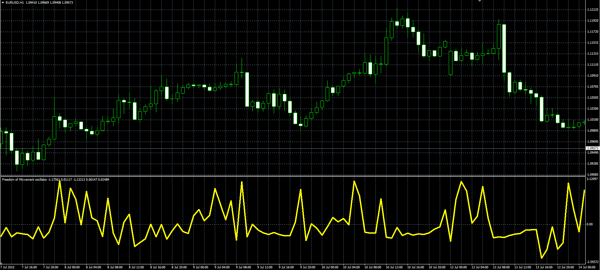

# Freedom of Movement oscillator

> Source: https://fxcodebase.com/code/viewtopic.php?f=38&t=62458  
> Forum: 38 · Topic 62458 · 1 post(s)

---

## Freedom of Movement oscillator

**Alexander.Gettinger** · Fri Jul 24, 2015 10:10 am

Formula:
FoM[i] = (vByM[i]-avF)/sdF, where
sdF - StdDev(vByM) with [Period] number of periods,
avF - MA(vByM) with [Period] number of periods and [Method] type,
vByM = Vol/Move,
Vol = 1+9*(RV-MinV)/Abs(demonV),
demonV = MaxV-MinV,
MaxV, MinV - maximum and minimum values of RV at range from [i-Period+1] to [i],
Move = 1+9*(aMove-MinM)/Abs(demonM),
demomM = MaxM-MinM,
MaxM, MinM - maximum and minimum values of aMove at range [i-Period+1] to [i],
aMove[i] = Abs(Close[i]-Close[i-1])/Close[i-1],
RV = (Volume-av)/sd,
sd - StdDev(Volume) with [Period] number of periods,
av - MA(Volume) with [Period] number of periods and [Method] type.

 

Download:

 [FoM.mq4](files/101543/FoM.mq4)
