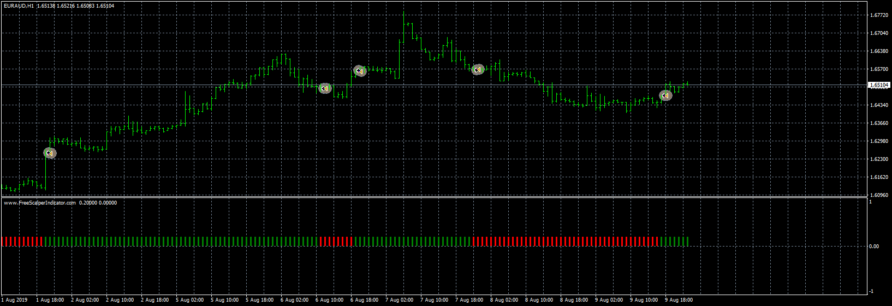

# FreeScalper_Expert

> Source: https://fxcodebase.com/code/viewtopic.php?f=38&t=70488  
> Forum: 38 · Topic 70488 · 16 post(s)

---

## FreeScalper_Expert

**Apprentice** · Sat Sep 26, 2020 2:35 am

Based on request.
[viewtopic.php?f=27&t=69751&start=30](https://fxcodebase.com/code/viewtopic.php?f=27&t=69751&start=30)

 [freescalperindicator.ex4](files/137924/freescalperindicator.ex4)

 [FreeScalper_Expert.mq4](files/137924/FreeScalper_Expert.mq4)

---

## Re: FreeScalper_Expert

**yolerap** · Sat Sep 26, 2020 5:16 am

Thank you very much, it's all I expected !

Please add the option : End of turn/Live, Time to trade, direct/reverse, daily profit and % of account for Lot size.

thank you !

---

## Re: FreeScalper_Expert

**coolguy17172** · Sat Sep 26, 2020 9:22 pm

Hey, could you fix the EA to alternate between buy and sell signals. It sometimes opens 3 sell trades in a row. Shown in pics below, bottom part shows trades. Horizontal Lines show what trades should’ve been taken

Also could you add a trailing stop loss , thank you

---

## Re: FreeScalper_Expert

**Apprentice** · Sun Sep 27, 2020 1:46 pm

Your request is added to the development list.
Development reference 2111.

---

## Re: FreeScalper_Expert

**coolguy17172** · Sat Oct 03, 2020 7:50 pm

Hey, can you quickly add a function/condition to this EA so that it force closes any open orders when the freescalperindicator direction changes regardless of if tp/sl is hit.

 Example - when the direction(red or green) changes, if the current open order hasn't hit tp/sl yet the EA will force close the open order and opens a trade in the new direction. Meaning the trade can be closed even without hitting tp/sl.

---

## Re: FreeScalper_Expert

**Apprentice** · Mon Oct 05, 2020 9:01 am

Your request is added to the development list.
Development reference 2141.

---

## Re: FreeScalper_Expert

**taipan** · Tue Oct 06, 2020 4:02 am

> **Apprentice wrote:**
>
>
> FreeScalper_Expert.mq4
>
>
> Try this version.

When this ea is loaded on chart with the indicator, there are non stop errors as shown below:
7:00:19.644	FreeScalper_Expert GBPUSD,H1: max_deposit 500 curent_balance 500 current_balance_in_precent 0
0	17:00:19.738	FreeScalper_Expert GBPUSD,H1: max_deposit 500 curent_balance 500 current_balance_in_precent 0
0	17:00:19.922	FreeScalper_Expert GBPUSD,H1: max_deposit 500 curent_balance 500 current_balance_in_precent 0
0	17:00:20.002	FreeScalper_Expert GBPUSD,H1: max_deposit 500 curent_balance 500 current_balance_in_precent 0
0	17:00:20.122	FreeScalper_Expert GBPUSD,H1: max_deposit 500 curent_balance 500 current_balance_in_precent 0
0	17:00:20.307	FreeScalper_Expert AUDUSD,H1: max_deposit 500 curent_balance 500 current_balance_in_precent 0
0	17:00:20.512	FreeScalper_Expert AUDUSD,H1: max_deposit 500 curent_balance 500 current_balance_in_precent 0
0	17:00:20.907	FreeScalper_Expert AUDUSD,H1: max_deposit 500 curent_balance 500 current_balance_in_precent 0
0	17:00:21.423	FreeScalper_Expert AUDUSD,H1: max_deposit 500 curent_balance 500 current_balance_in_precent 0
0	17:00:21.711	FreeScalper_Expert AUDUSD,H1: max_deposit 500 curent_balance 500 current_balance_in_precent 0
0	17:00:23.728	FreeScalper_Expert AUDUSD,H1: max_deposit 500 curent_balance 500 current_balance_in_precent 0
0	17:00:23.828	FreeScalper_Expert GBPUSD,H1: max_deposit 500 curent_balance 500 current_balance_in_precent 0
0	17:00:24.124	FreeScalper_Expert AUDUSD,H1: max_deposit 500 curent_balance 500 current_balance_in_precent 0
0	17:00:24.449	FreeScalper_Expert AUDUSD,H1: max_deposit 500 curent_balance 500 current_balance_in_precent 0
0	17:00:24.514	FreeScalper_Expert GBPUSD,H1: max_deposit 500 curent_balance 500 current_balance_in_precent 0
0	17:00:24.629	FreeScalper_Expert GBPUSD,H1: max_deposit 500 curent_balance 500 current_balance_in_precent 0
0	17:00:24.704	FreeScalper_Expert GBPUSD,H1: max_deposit 500 curent_balance 500 current_balance_in_precent 0
0	17:00:25.538	FreeScalper_Expert GBPUSD,H1: max_deposit 500 curent_balance 500 current_balance_in_precent 0
0	17:00:25.653	FreeScalper_Expert GBPUSD,H1: max_deposit 500 curent_balance 500 current_balance_in_precent 0

---

## Re: FreeScalper_Expert

**Apprentice** · Tue Oct 06, 2020 7:49 am

Your request is added to the development list.
Development reference 2154.

---

## Re: FreeScalper_Expert

**Protrader** · Mon Oct 12, 2020 4:44 am

Please force the strategy to don't open position at each green signal and red signal. I want that the strategy open just one trade for one signal and wait the reverse signal to open new.

Thank you,

---

## Re: FreeScalper_Expert

**Apprentice** · Mon Oct 12, 2020 4:48 am

Your request is added to the development list.
Development reference 2175.

---

## Re: FreeScalper_Expert

**coolguy17172** · Mon Oct 12, 2020 9:12 pm

Hey apprentice, I tested the updated version based on my task 2141. The problem still hasn’t been fixed, it says orderclose error 138 whenever it tries to force close the order. Could you fix this?
Thank you, you are on the right track!

---

## Re: FreeScalper_Expert

**Apprentice** · Tue Oct 13, 2020 6:04 am

Your request is added to the development list.
Development reference 2180.

---

## Re: FreeScalper_Expert

**Apprentice** · Mon Oct 19, 2020 5:37 am

Try it now.

---

## Re: FreeScalper_Expert

**coolguy17172** · Mon Oct 19, 2020 11:07 am

Hey apprentice, I tried the updated version.
It still doesn’t work, it shows the same “order closer error 138”
Thank you

---

## Re: FreeScalper_Expert

**ElectricSavant** · Thu Oct 22, 2020 6:15 am

This does not work. it gives an error "under 0.01" or something like that.

order lot type: fixed
order lot value" 0.01

---

## Re: FreeScalper_Expert

**ElectricSavant** · Thu Oct 22, 2020 10:42 am

Can this trade in a live account? The fixed lot always states that it is less than 0.01 no matter what you enter.

ES
