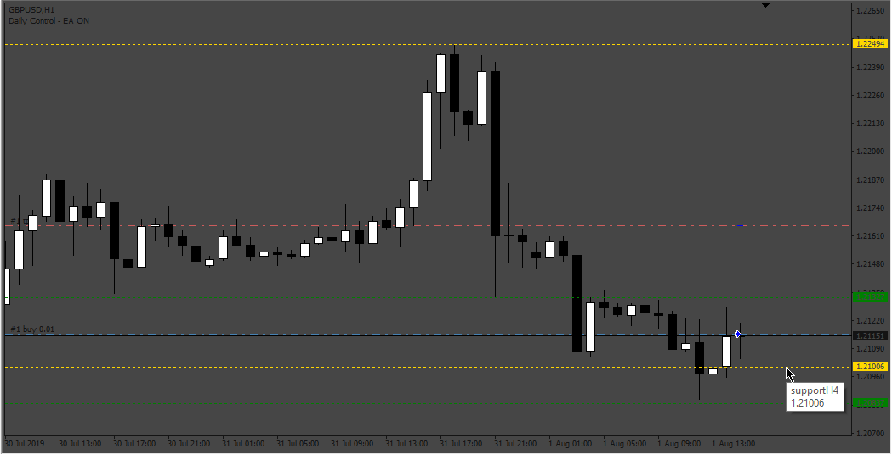
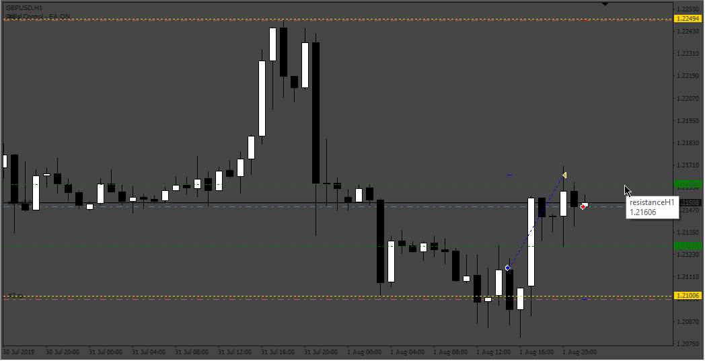

# FSR_EA

> Source: https://fxcodebase.com/code/viewtopic.php?f=38&t=72991  
> Forum: 38 · Topic 72991 · 5 post(s)

---

## FSR_EA

**Apprentice** · Wed Nov 30, 2022 1:51 pm

 

Based on the request.
[https://fxcodebase.com/code/viewtopic.php?f=27&p=147828](https://fxcodebase.com/code/viewtopic.php?f=27&p=147828)

 [FractalSupportResistance.mq4](files/148506/FractalSupportResistance.mq4)

 [FSR_EA.mq4](files/148506/FSR_EA.mq4)

---

## Re: FSR_EA

**crypto0014** · Sat Dec 03, 2022 8:21 am

EA compiling having errors. Pls fix

---

## Re: FSR_EA

**Sensible** · Mon Dec 05, 2022 12:10 am

Hi Apprentice and teams of FXCodebase,

I do appreciate the great work doing here and thanks for the responds on this request.

I have issue with it, I am trying to load it to a chart after installed but it not loading. I tried to delete it and redownload and reinstalled but still doing same thing. I went to check expert report this is the message giving me:

2022.12.05 05:48:17.905	cannot open file 'C:\Users\Administrator\AppData\Roaming\MetaQuotes\Terminal\EB63D99DC6A350D20347D75C798620DE\MQL4\Experts\FSR_EA.ex4' [2]

and again on MQL4 folder it only show Mq4 only instead of both Mq4 and Ex4 together and on the Navigator panel the head cap show ash colour instead of gold colour.

Please Sir, help me to check what is wrong with it.

thanks Sir

---

## Re: FSR_EA

**Apprentice** · Mon Dec 05, 2022 5:51 am

We have added your request to the development list.
Development reference 793.

---

## Re: FSR_EA

**Apprentice** · Mon Dec 05, 2022 6:38 am

Fixed.
