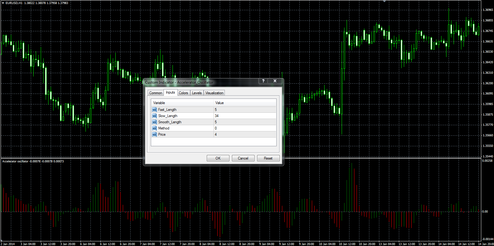

# Full Accelerator oscillator (AC)

> Source: https://fxcodebase.com/code/viewtopic.php?f=38&t=60392  
> Forum: 38 · Topic 60392 · 4 post(s)

---

## Full Accelerator oscillator (AC)

**Alexander.Gettinger** · Mon Mar 03, 2014 10:02 am

Unfortunately, the built-in Accelerator oscillator has no parameters.
The full version has parameters that a trader can change.

 

Download:

 [Accelerator_Oscillator.mq4](files/92993/Accelerator_Oscillator.mq4)

 [Full_Accelerator_Oscillator.mq5](files/92993/Full_Accelerator_Oscillator.mq5)

---

## Re: Full Accelerator oscillator (AC)

**Javii7777** · Sun Dec 31, 2023 6:54 am

Can we get a MT5 version of this. Please

---

## Re: Full Accelerator oscillator (AC)

**Apprentice** · Tue Jan 02, 2024 12:41 pm

We have added your request to the development list.
Development reference 7

---

## Re: Full Accelerator oscillator (AC)

**Apprentice** · Wed Jan 17, 2024 1:14 pm

MT5 version added.
