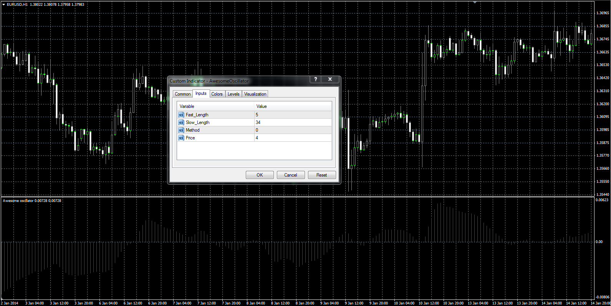
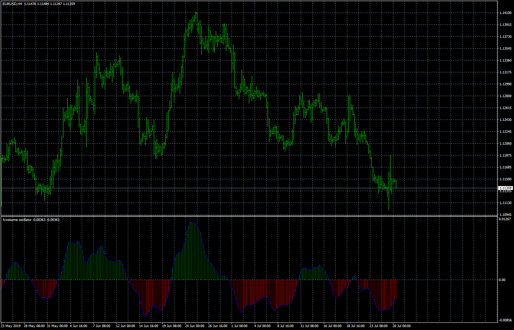

# Full Awesome oscillator (AO)

> Source: https://fxcodebase.com/code/viewtopic.php?f=38&t=60391  
> Forum: 38 · Topic 60391 · 4 post(s)

---

## Full Awesome oscillator (AO)

**Alexander.Gettinger** · Mon Mar 03, 2014 10:01 am

Unfortunately, the built-in Awesome oscillator has no parameters.
The full version has parameters that a trader can change.

 

Download:

 [AwesomeOscillator.mq4](files/92992/AwesomeOscillator.mq4)

---

## Re: Full Awesome oscillator (AO)

**Apprentice** · Mon Aug 19, 2019 5:13 am

Based on request.
[viewtopic.php?f=27&t=68794](https://fxcodebase.com/code/viewtopic.php?f=27&t=68794)

 [Custom AwesomeOscillator.mq4](files/128022/Custom%20AwesomeOscillator.mq4)

TS2/Lua version
[viewtopic.php?f=17&t=68824](https://fxcodebase.com/code/viewtopic.php?f=17&t=68824)

---

## Re: Full Awesome oscillator (AO)

**robertpire** · Wed Aug 21, 2019 4:10 am

Hi , thanks but i whish lua version.

thanks

---

## Re: Full Awesome oscillator (AO)

**Apprentice** · Wed Aug 21, 2019 6:46 am

TS2/Lua version
[viewtopic.php?f=17&t=68824](https://fxcodebase.com/code/viewtopic.php?f=17&t=68824)
