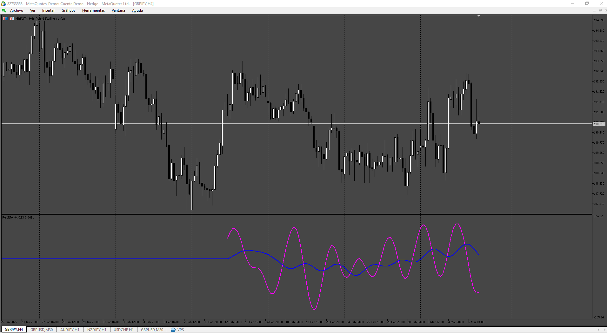
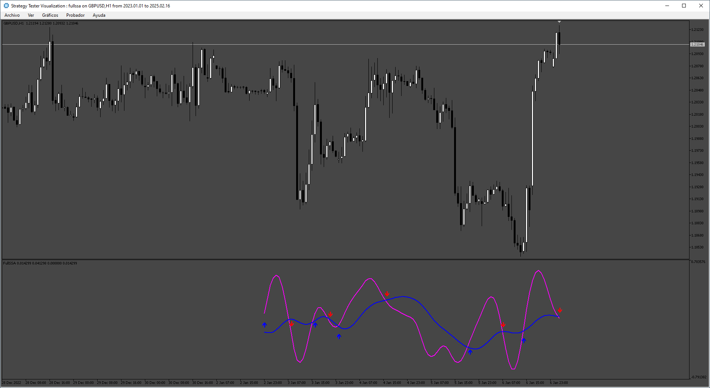

# fullssa

> Source: https://fxcodebase.com/code/viewtopic.php?f=38&t=75700  
> Forum: 38 · Topic 75700 · 3 post(s)

---

## fullssa

**Apprentice** · Mon Mar 10, 2025 1:31 pm

Based on the request.
[https://fxcodebase.com/code/viewtopic.p ... 36#p158436](https://fxcodebase.com/code/viewtopic.php?f=27&p=158436#p158436)

 [fullssa.mq5](files/158543/fullssa.mq5)

---

## Re: fullssa

**Luci Lira** · Mon Mar 10, 2025 3:36 pm

> **Apprentice wrote:**
>
>
> 156.png
>
>
> Based on the request.
> [https://fxcodebase.com/code/viewtopic.p ... 36#p158436](https://fxcodebase.com/code/viewtopic.php?f=27&p=158436#p158436)
>
>
> fullssa.mq5

Hello, that's right, but the arrows are missing when the lines cross. Could you also include the SUP and INF levels in the parameters, where above the SUP only plots sell signals and below the INF only plots buy signals? Thanks for the support

---

## Re: fullssa

**Apprentice** · Sun Mar 16, 2025 1:31 pm

 [fullssa with arrows.mq5](files/158633/fullssa%20with%20arrows.mq5)
