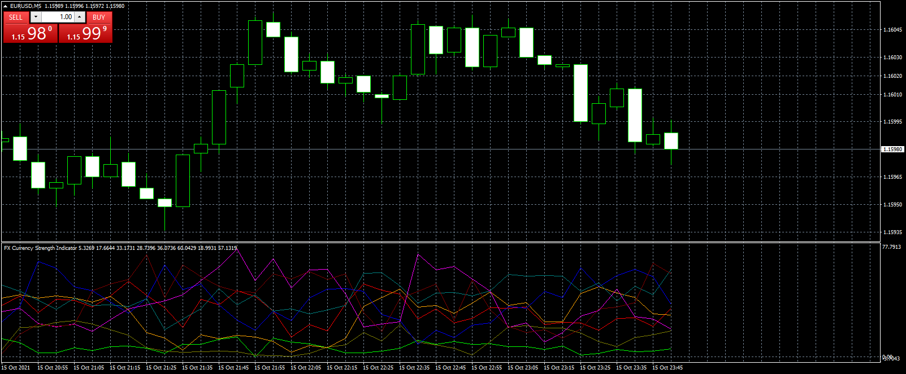

# FX_Currency_Strength_Indicator

> Source: https://fxcodebase.com/code/viewtopic.php?f=38&t=71579  
> Forum: 38 · Topic 71579 · 3 post(s)

---

## FX_Currency_Strength_Indicator

**Apprentice** · Sat Oct 16, 2021 3:37 pm

TS 2 version.
[https://fxcodebase.com/code/viewtopic.p ... 36#p143736](https://fxcodebase.com/code/viewtopic.php?f=17&p=143736#p143736)

 [FX_Currency_Strength_Indicator.mq4](files/143966/FX_Currency_Strength_Indicator.mq4)

---

## Re: FX_Currency_Strength_Indicator

**sumolo** · Tue Jul 25, 2023 10:02 pm

Dear admin ,

May i request MT5 version for
 Daily_Currency_Strength_Indicator+alert.mq4
 Daily_Currency_Strength_Indicator.mq4

Thank you

---

## Re: FX_Currency_Strength_Indicator

**Apprentice** · Mon Jul 31, 2023 5:58 pm

[https://fxcodebase.com/code/viewtopic.p ... 96#p151796](https://fxcodebase.com/code/viewtopic.php?f=38&p=151796#p151796)

We have added your request to the development list.
Development reference 668.
