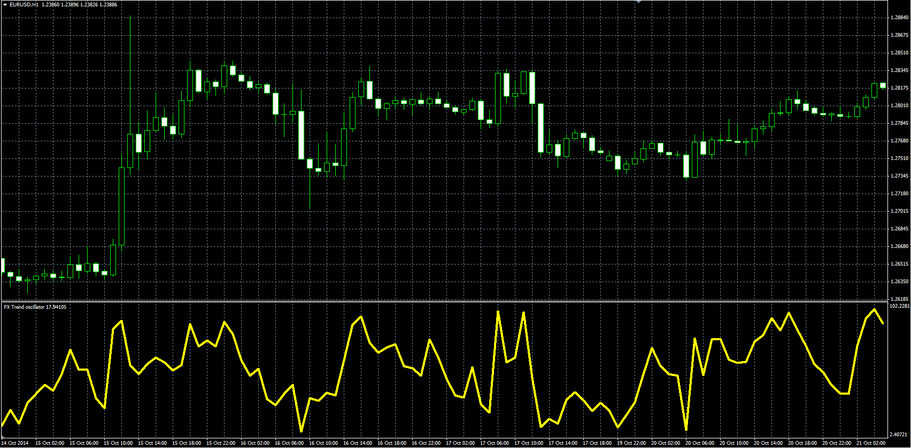

# FX Trend

> Source: https://fxcodebase.com/code/viewtopic.php?f=38&t=61520  
> Forum: 38 · Topic 61520 · 1 post(s)

---

## FX Trend

**Alexander.Gettinger** · Fri Nov 21, 2014 5:13 pm

Original LUA oscillator: [viewtopic.php?f=17&t=4482](https://fxcodebase.com/code/viewtopic.php?f=17&t=4482).

Formulas:
FXT = K*((Close-L1)/(D1*Short_Length)+(Close-L2)/(D2*Mid_Length)+(Close-L3)/(D3*Long_Length)), where
D1 = H1-L1,
D2 = H2-L2,
D3 = H3-L3,
L1, H1 - lowest and highest prices at range from (i-Short_Length+1) to (i),
L2, H2 - lowest and highest prices at range from (i-Mid_Length+1) to (i),
L3, H3 - lowest and highest prices at range from (i-Long_Length+1) to (i),
K = 100/(1/Short_Length+1/Mid_Length+1/Long_Length).

 

Download:

 [FX_Trend.mq4](files/97293/FX_Trend.mq4)
