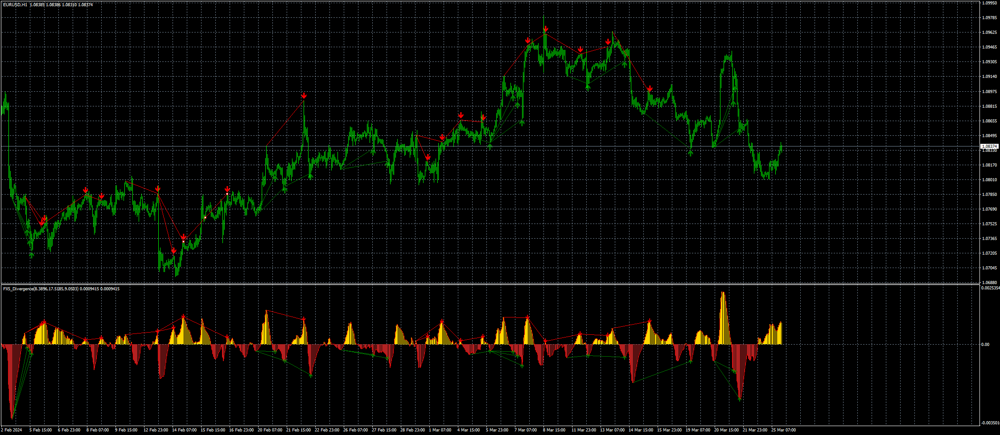

# fx5_dema_macd_divergence_v1.201+alert+arrow

> Source: https://fxcodebase.com/code/viewtopic.php?f=38&t=74817  
> Forum: 38 · Topic 74817 · 5 post(s)

---

## fx5_dema_macd_divergence_v1.201+alert+arrow

**Apprentice** · Mon Apr 29, 2024 5:44 am

Based on the request.
 [https://fxcodebase.com/code/viewtopic.php?f=27&p=154908](https://fxcodebase.com/code/viewtopic.php?f=27&p=154908)

 [fx5_dema_macd_divergence_v1.201+alert+arrow_v2.mq4](files/155166/fx5_dema_macd_divergence_v1.201alertarrow_v2.mq4)

 [FX5_DEMA_MACD_Divergence_EA_v1.00.mq4](files/155166/FX5_DEMA_MACD_Divergence_EA_v1.00.mq4)

---

## Re: fx5_dema_macd_divergence_v1.201+alert+arrow

**trtrader** · Mon Apr 29, 2024 6:33 pm

Can we create an EA buy sell based on arrows?

---

## Re: fx5_dema_macd_divergence_v1.201+alert+arrow

**trtrader** · Wed May 15, 2024 9:08 am

Greet indicator but it doesn't refresh itself. you will not see arrows until you change the timeframe and switch back to update it. This is why the alert function doesn't work.

Could you please fix this and create an EA based on arrows that will close the position on the opposite arrow and open a new one?

Thank you

---

## Re: fx5_dema_macd_divergence_v1.201+alert+arrow

**Apprentice** · Fri May 17, 2024 4:23 pm

We have added your request to the development list.
Development reference 390

---

## Re: fx5_dema_macd_divergence_v1.201+alert+arrow

**Apprentice** · Wed May 29, 2024 9:21 am

FX5_DEMA_MACD_Divergence_EA_v1.00.mq4 added.
