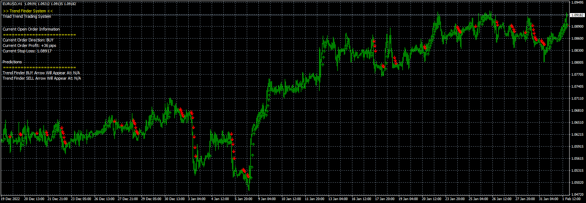
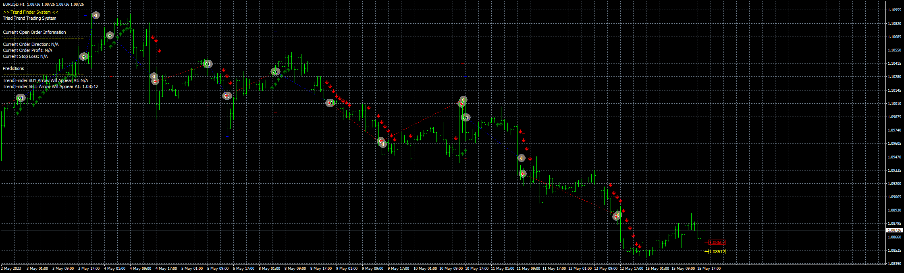
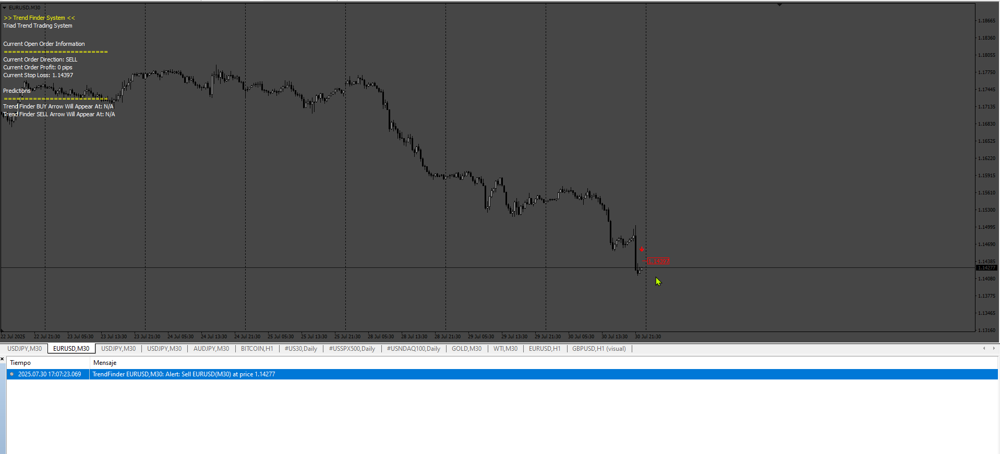
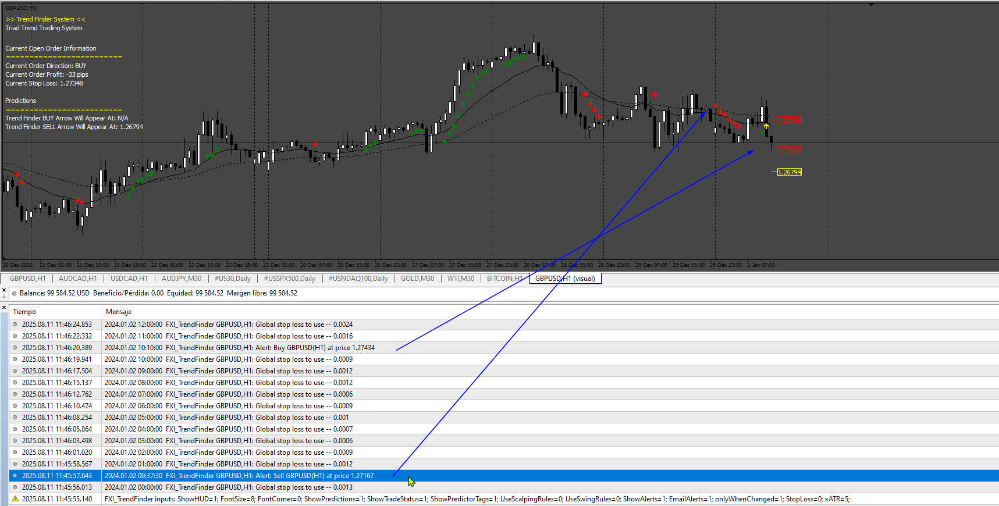

# [FXI]TrendFinder

> Source: https://fxcodebase.com/code/viewtopic.php?f=38&t=74129  
> Forum: 38 · Topic 74129 · 18 post(s)

---

## [FXI]TrendFinder

**Apprentice** · Thu Sep 07, 2023 6:02 am

 [(FXI)TrendFinder.mq4](files/152418/FXITrendFinder.mq4)

Based on the request.
[https://fxcodebase.com/code/viewtopic.php?f=27&p=152313](https://fxcodebase.com/code/viewtopic.php?f=27&p=152313)

 

 [(FXI)TrendFinder_EA_v1.00.mq4](files/152418/FXITrendFinder_EA_v1.00.mq4)

---

## Re: [FXI]TrendFinder

**kimhong** · Sun Sep 10, 2023 2:55 am

> **Apprentice wrote:**
>
>
> eurusd-h1-fxcm-australia-pty.png
>
>
> Based on the request.
> [https://fxcodebase.com/code/viewtopic.php?f=27&p=152313](https://fxcodebase.com/code/viewtopic.php?f=27&p=152313)
>
>
> [FXI]TrendFinder.mq4

Dear Programmers,

I download the Indicator and see that.but need help the indicator show the arrow on before candle is good please modifie

Thanks & Regards
Kim

---

## Re: [FXI]TrendFinder

**Teja_Siddani** · Fri Oct 20, 2023 7:44 am

Hi, Can you please translate this indicator for readable, possible to convert MT4 EA

---

## Re: [FXI]TrendFinder

**Teja_Siddani** · Fri Oct 20, 2023 7:46 am

I tried to get data using iCustom but it's not working giving false signals

---

## Re: [FXI]TrendFinder

**Teja_Siddani** · Fri Nov 10, 2023 5:28 am

is it possible to convert this code to EA??

---

## Re: [FXI]TrendFinder

**Apprentice** · Fri Nov 10, 2023 3:02 pm

We have added your request to the development list.
Development reference 998

---

## Re: [FXI]TrendFinder

**Apprentice** · Mon Nov 27, 2023 4:43 am

EA Added.

---

## Re: [FXI]TrendFinder

**rickCreations** · Tue Nov 28, 2023 10:25 am

Indicator is showing lots of Array out of Range errors. :

---

## Re: [FXI]TrendFinder

**Apprentice** · Tue Nov 28, 2023 10:52 am

We have added your request to the development list.
Development reference 1052

---

## Re: [FXI]TrendFinder

**Apprentice** · Fri Aug 01, 2025 4:37 am

 [(FXI)TrendFinder.mq4](files/160084/FXITrendFinder.mq4)

---

## Re: [FXI]TrendFinder

**sdfx70** · Mon Aug 04, 2025 12:08 pm

Please configure the notification for this indicator so that it triggers only when there is a trend reversal — and not repeatedly in the same direction.
The notification should appear both on the chart and on the mobile device.
Thank you!

---

## Re: [FXI]TrendFinder

**Apprentice** · Sun Aug 10, 2025 5:24 am

We have added your request to the development list.
Development reference 513

---

## Re: [FXI]TrendFinder

**Apprentice** · Wed Aug 13, 2025 3:46 am

 [FXI_TrendFinder.mq4](files/160228/FXI_TrendFinder.mq4)

---

## Re: [FXI]TrendFinder

**sdfx70** · Mon Nov 24, 2025 4:46 am

Please add the following indicator to the expert advisor as a filter with these conditions:

[https://fxcodebase.com/code/download/fi ... 720a1bc9b6](https://fxcodebase.com/code/download/file.php?id=45103&sid=852432b8938d8dfb792e95720a1bc9b6)

- When the RSX on the main chart issues a bullish signal, the expert advisor is allowed to open long positions.

- When the RSX on the main chart issues a bearish signal, the expert advisor is allowed to open short positions.

- When the RSX generates an opposite signal, the expert advisor must immediately close all open positions.

Thanks admin .

---

## Re: [FXI]TrendFinder

**Apprentice** · Sat Nov 29, 2025 12:00 pm

We have added your request to the development list.
Development reference 765

---

## Re: [FXI]TrendFinder

**Apprentice** · Wed Dec 31, 2025 10:43 am

[(FXI)TrendFinder.mq4](files/161476/FXITrendFinder.mq4)

 [rsx_v3.mq4](files/161476/rsx_v3.mq4)

 [5DTrendFinder_EA_v1.00.mq4](files/161476/5DTrendFinder_EA_v1.00.mq4)

---

## Re: [FXI]TrendFinder

**hangover** · Sun Jan 18, 2026 4:54 am

Plz mq5 for indicator

---

## Re: [FXI]TrendFinder

**Apprentice** · Mon Jan 26, 2026 3:51 am

Answered via email.
