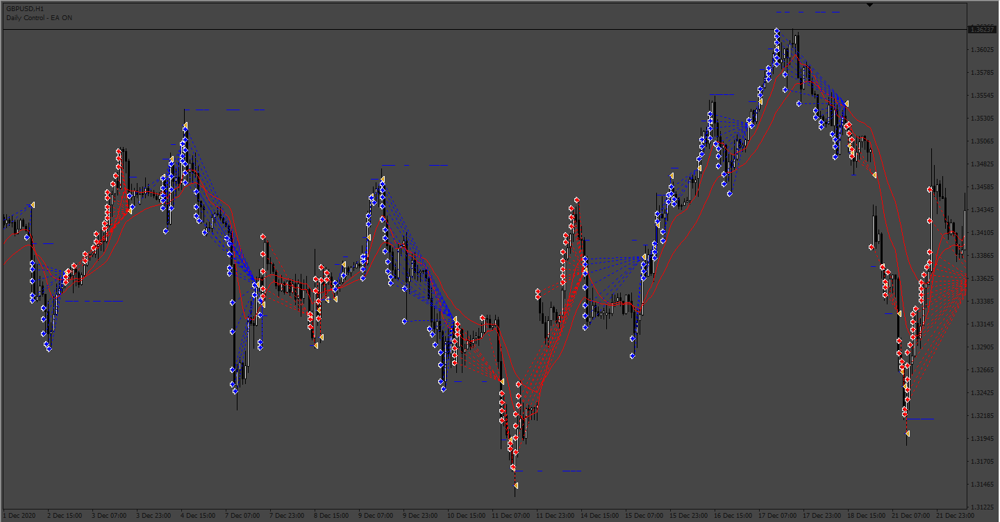
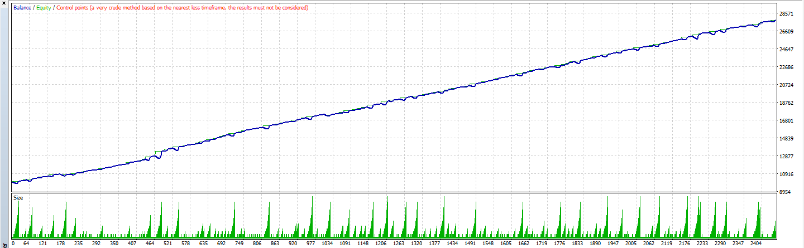
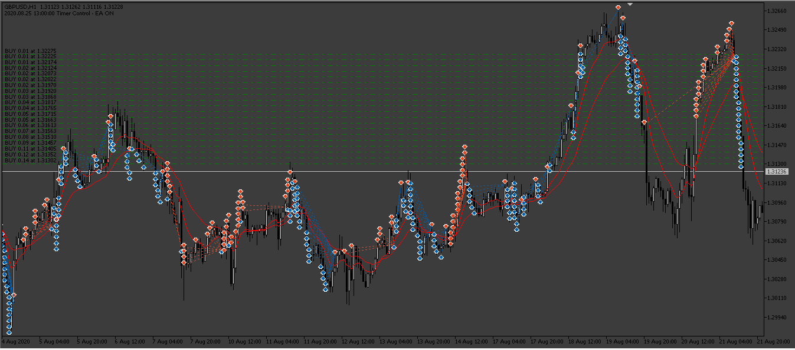

# FxMariner EA

> Source: https://fxcodebase.com/code/viewtopic.php?f=38&t=73493  
> Forum: 38 · Topic 73493 · 6 post(s)

---

## FxMariner EA

**Apprentice** · Sat Mar 18, 2023 2:20 am

 

Based on the request.
[https://fxcodebase.com/code/viewtopic.php?f=27&p=149942](https://fxcodebase.com/code/viewtopic.php?f=27&p=149942)

 [FxMariner.mq4](files/150031/FxMariner.mq4)

 

 [Mariner_MT5.mq5](files/150031/Mariner_MT5.mq5)

---

## Re: FxMariner

**phnthnhnm** · Sat Mar 18, 2023 3:18 am

Hi Expert,
May I ask mql5 version please?
Thank you.

---

## Re: FxMariner

**phnthnhnm** · Sat Mar 18, 2023 3:39 am

Hi Apprentice,
My backtest result is not as same as you.
May I ask your set file for reference?
Thank you.

---

## Re: FxMariner

**Apprentice** · Mon Mar 20, 2023 11:04 am

We have added your request to the development list.
Development reference 257.

---

## Re: FxMariner

**jollyjegan** · Fri Mar 24, 2023 1:25 am

works good. can you add "maximum lot" set ? & add averaging "Take profit" - true/false

Thanks in advance

> **Apprentice wrote:**
>
>
> 225pic.png
>
>
>
>
> 225pic2.png
>
>
> Based on the request.
> [https://fxcodebase.com/code/viewtopic.php?f=27&p=149942](https://fxcodebase.com/code/viewtopic.php?f=27&p=149942)
>
>
> FxMariner.mq4

---

## Re: FxMariner

**Apprentice** · Sat Mar 25, 2023 12:48 pm

Mariner_MT5.mq5 added.
