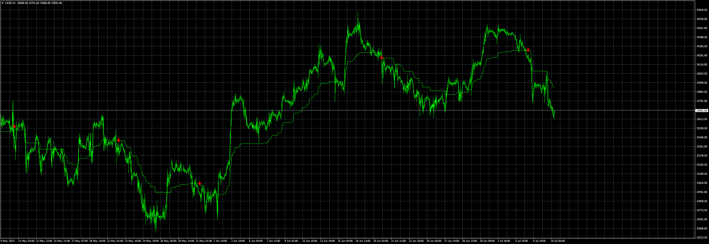

# G-Channel_Trend_Detection

> Source: https://fxcodebase.com/code/viewtopic.php?f=38&t=73910  
> Forum: 38 · Topic 73910 · 6 post(s)

---

## G-Channel_Trend_Detection

**Apprentice** · Mon Jul 10, 2023 3:20 am

Based on the request.
[https://fxcodebase.com/code/viewtopic.php?f=27&p=150877](https://fxcodebase.com/code/viewtopic.php?f=27&p=150877)

 [G-Channel_Trend_Detection.mq4](files/151566/G-Channel_Trend_Detection.mq4)

TS2 version
[https://fxcodebase.com/code/viewtopic.php?f=17&t=73931](https://fxcodebase.com/code/viewtopic.php?f=17&t=73931)

---

## Re: G-Channel_Trend_Detection

**aednairab** · Tue Jul 11, 2023 3:37 pm

only sell signals , why buy signals are not appear, also could you add push notification, regards.

---

## Re: G-Channel_Trend_Detection

**bartwas1** · Wed Jul 12, 2023 3:34 am

Hello Apprentice

Just quick question. Does this indicator have a marketscope version? I'm asking, because it looks interesting.
Kind regards
B.

---

## Re: G-Channel_Trend_Detection

**Apprentice** · Wed Jul 12, 2023 10:47 am

Fixed.

---

## Re: G-Channel_Trend_Detection

**Apprentice** · Wed Jul 12, 2023 10:50 am

We have added your request to the development list.
Development reference 606.

---

## Re: G-Channel_Trend_Detection

**Apprentice** · Thu Jul 13, 2023 2:45 pm

TS2 version
[https://fxcodebase.com/code/viewtopic.php?f=17&t=73931](https://fxcodebase.com/code/viewtopic.php?f=17&t=73931)
