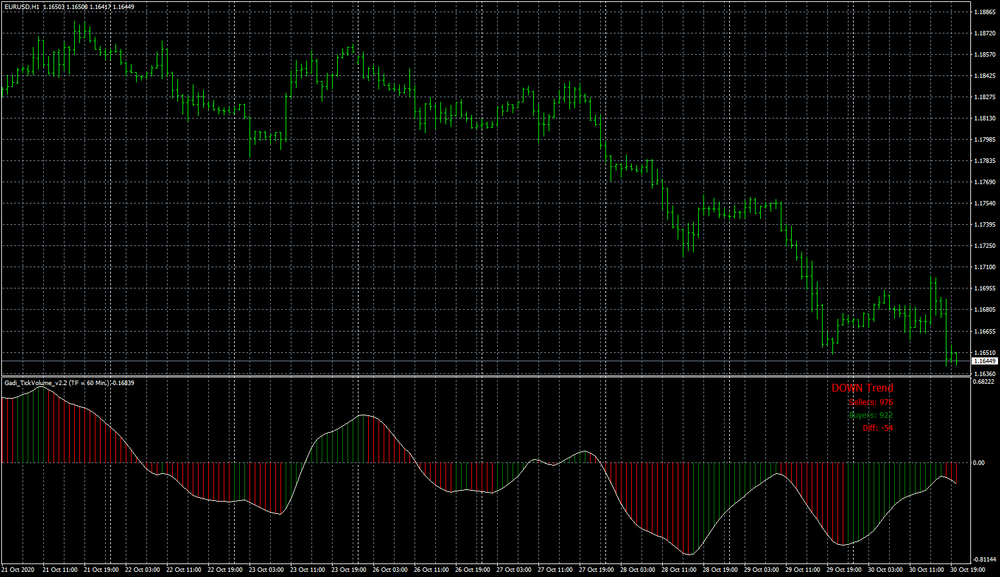
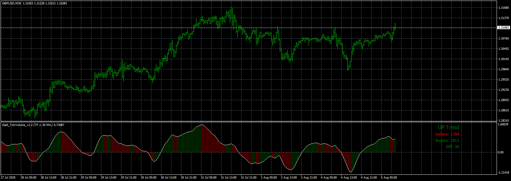

# Gadi_TickVolume

> Source: https://fxcodebase.com/code/viewtopic.php?f=38&t=70643  
> Forum: 38 · Topic 70643 · 17 post(s)

---

## Gadi_TickVolume

**Apprentice** · Thu Nov 19, 2020 3:52 pm

Based on request.
[viewtopic.php?f=27&t=70615](https://fxcodebase.com/code/viewtopic.php?f=27&t=70615)

 [Gadi_TickVolume.mq4](files/139010/Gadi_TickVolume.mq4)

 [Gadi_TickVolume.mq5](files/139010/Gadi_TickVolume.mq5)

---

## Re: Gadi_TickVolume

**Frenchy** · Thu Nov 19, 2020 10:05 pm

Indicator downloads, i see it in "navigator" but not in "indicator list" and will not attach to chart???

---

## Re: Gadi_TickVolume

**Apprentice** · Fri Nov 20, 2020 3:11 am

How to install indicator to MT4 platform
[viewtopic.php?f=38&t=64381](https://fxcodebase.com/code/viewtopic.php?f=38&t=64381)
That trading station you are using?

---

## Re: Gadi_TickVolume

**Frenchy** · Fri Nov 20, 2020 11:24 am

Strongly believe i have a problem with platform or settings??? Have downloaded custom indicators hundreds if not thousands of times in the past without any issues. Noticed it's been happening for a while now, not a new issue. Can you help? Any ideas what could be causing this issue? Like i said, after download, i see the indicator in "navigator" but not in the "indicator list" and it will not attach to the chart??

---

## Re: Gadi_TickVolume

**Frenchy** · Sat Nov 21, 2020 3:02 pm

I see you ,ight have sent a new message but can't access it to save my life???

Can you help with this download issue, would be greatly appreciated.

Thanks, Frenchy.

---

## Re: Gadi_TickVolume

**Apprentice** · Sun Nov 22, 2020 4:55 am

I don't have any problem with it.
Did not have any compilation errors.

---

## Re: Gadi_TickVolume

**Frenchy** · Mon Nov 23, 2020 9:44 pm

From what i have researched, i would have to revert to a previous mt4 build but supposedly mt4 does not allow that anymore since October 1st. I have version 4.00, build 1280
Any idea? Is there a program to update older indicators to work on a newer build or something?

Thanks, Frenchy

---

## Re: Gadi_TickVolume

**Apprentice** · Tue Nov 24, 2020 5:27 am

I also have, was tested on version 4.00, build 1280

---

## Re: Gadi_TickVolume

**Frenchy** · Tue Nov 24, 2020 11:54 am

Thanks Apprentice, can you please send me the ex4 file.

---

## Re: Gadi_TickVolume

**yolerap** · Tue Nov 24, 2020 2:24 pm

Please make an MT5 version.

Thank you,

---

## Re: Gadi_TickVolume

**Apprentice** · Wed Nov 25, 2020 10:58 am

Your request is added to the development list.
Development reference 2361.

---

## Re: Gadi_TickVolume

**Frenchy** · Sun Nov 29, 2020 7:27 pm

Could you please send me the ex4 file.

Thanks, Frenchy

---

## Re: Gadi_TickVolume

**Apprentice** · Mon Nov 30, 2020 10:13 am

MT4 can work with MQ4 without any problem.
It will compile it internally.

---

## Re: Gadi_TickVolume

**Frenchy** · Tue Dec 01, 2020 10:17 am

My platform seems to not be able to compile MQL4 files internally but will execute EX4 files?? That's why i was hoping you could send me the EX4 file...

---

## Re: Gadi_TickVolume

**Apprentice** · Wed Dec 02, 2020 3:21 am

[Gadi_TickVolume.ex4](files/139247/Gadi_TickVolume.ex4)

Try this version.

---

## Re: Gadi_TickVolume

**Frenchy** · Wed Dec 02, 2020 11:44 am

Thanks Apprentice, the EX4 file works like a charm, perfect. I guess my platform just doesn't compile anymore???
I know i'm asking a lot but would it be possible to put the "Diff" where the yellow line is, as indicated in the attached pic., that way the window can be minimized to the max.
Greatly appreciate all your time and effort Apprentice,
Thanks, Fremchy.

---

## Re: Gadi_TickVolume

**Apprentice** · Fri Dec 04, 2020 1:51 pm

Gadi_TickVolume.mq5 added.
