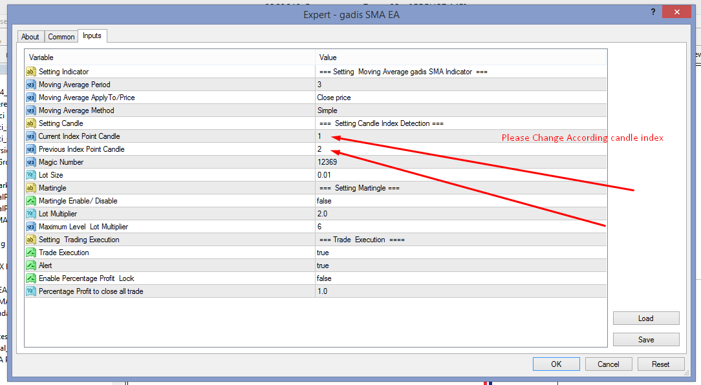

# gadis_SMA_EA

> Source: https://fxcodebase.com/code/viewtopic.php?f=38&t=71612  
> Forum: 38 · Topic 71612 · 9 post(s)

---

## gadis_SMA_EA

**Apprentice** · Mon Nov 01, 2021 6:25 am

Based on the request.
[https://fxcodebase.com/code/viewtopic.php?f=27&p=14398](https://fxcodebase.com/code/viewtopic.php?f=27&p=14398)

 [gadis SMA.mq4](files/144121/gadis%20SMA.mq4)

 [gadis_SMA_EA.mq4](files/144121/gadis_SMA_EA.mq4)

---

## Re: gadis_SMA_EA

**papaprabu** · Mon Nov 08, 2021 3:16 am

thanks you sir

what do you mean by index point candle ?
is it like
candle now [0]
previous candle [1]
??

i try backtest today.
but there are only buy no sell

---

## Re: gadis_SMA_EA

**Apprentice** · Tue Nov 09, 2021 2:51 am

yes , you are right.

---

## Re: gadis_SMA_EA

**papaprabu** · Tue Jan 04, 2022 5:50 pm

the ea didnt work as rule sir

---

## Re: gadis_SMA_EA

**papaprabu** · Thu Jan 20, 2022 3:34 pm

> **Apprentice wrote:**
>
>
> Completed_Task.png
>
>
> Based on the request.
> [https://fxcodebase.com/code/viewtopic.php?f=27&p=14398](https://fxcodebase.com/code/viewtopic.php?f=27&p=14398)
>
>
> gadis SMA.mq4
>
>
>
>
> gadis_SMA_EA.mq4

this error comes up sir..
could you please check

sell order is having error

---

## Re: gadis_SMA_EA

**Apprentice** · Fri Jan 21, 2022 9:15 am

Your request is added to the development list.
Development reference 51.

---

## Re: gadis_SMA_EA

**Apprentice** · Fri Mar 04, 2022 12:03 pm

Try this version.

---

## Re: gadis_SMA_EA

**PhenomDC** · Thu Oct 27, 2022 8:30 am

Hello Apprentice, hope you're well. Please add stop loss, TP and breakeven to both buy and sell positions. I noticed it only breakeven on buy positions. Thanks in advance

---

## Re: gadis_SMA_EA

**Apprentice** · Sun Oct 30, 2022 4:23 am

We have added your request to the development list.
Development reference 691.
