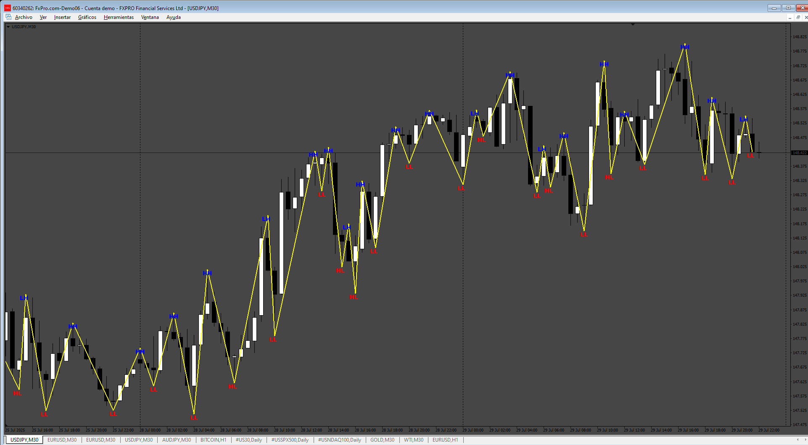
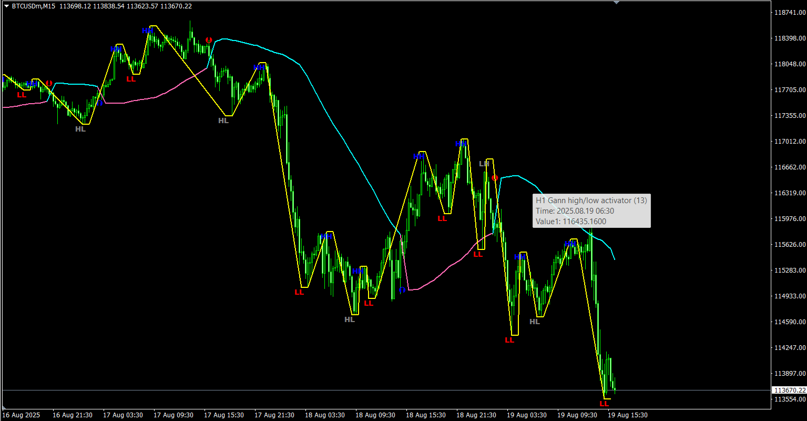

# Gann_HH_LL

> Source: https://fxcodebase.com/code/viewtopic.php?f=38&t=76202  
> Forum: 38 · Topic 76202 · 4 post(s)

---

## Gann_HH_LL

**Apprentice** · Fri Aug 01, 2025 4:50 am

Based on the request.
[https://fxcodebase.com/code/mcp.php?i=q ... 8&p=160012](https://fxcodebase.com/code/mcp.php?i=queue&mode=approve_details&f=38&p=160012)

 [Gann_HH_LL.mq4](files/160088/Gann_HH_LL.mq4)

---

## Re: Gann_HH_LL

**Teruyoshi** · Thu Aug 07, 2025 4:18 am

Thanks for uploading... but I should have told you about the indi clearly.
 What I want is a HH LL which is based on gann_hilo activator attached below.
Sorry to bother, but could you make one again?
 Many thanks in advance.

---

## Re: Gann_HH_LL

**Apprentice** · Sun Aug 10, 2025 5:06 am

We have added your request to the development list.
Development reference 507

---

## Re: Gann_HH_LL

**Apprentice** · Tue Aug 19, 2025 12:41 pm

 [Gann_High-Low_activator_(mtf_2B_alerts).mq4](files/160292/Gann_High-Low_activator_%28mtf_2B_alerts%29.mq4)
