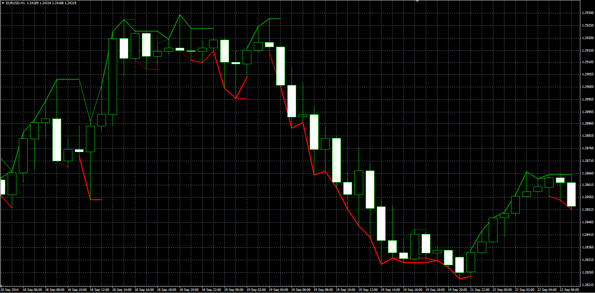

# Gann multi trend (indicator of small, medium and main trend)

> Source: https://fxcodebase.com/code/viewtopic.php?f=38&t=61540  
> Forum: 38 · Topic 61540 · 1 post(s)

---

## Gann multi trend (indicator of small, medium and main trend)

**Alexander.Gettinger** · Tue Nov 25, 2014 11:33 am

The indicator determines the trend in the short, medium and long term.

 

Download:

 [Gann_Multi_Trend.mq4](files/97370/Gann_Multi_Trend.mq4)
