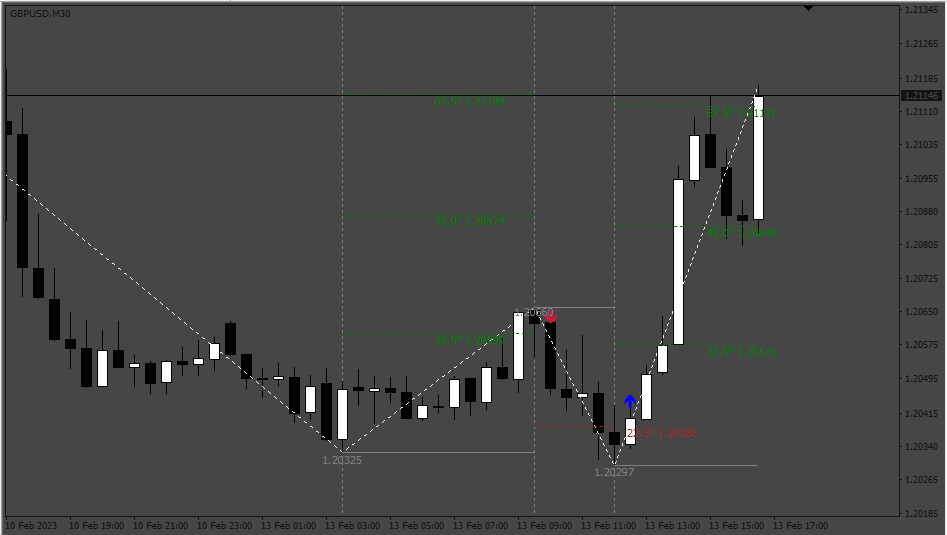
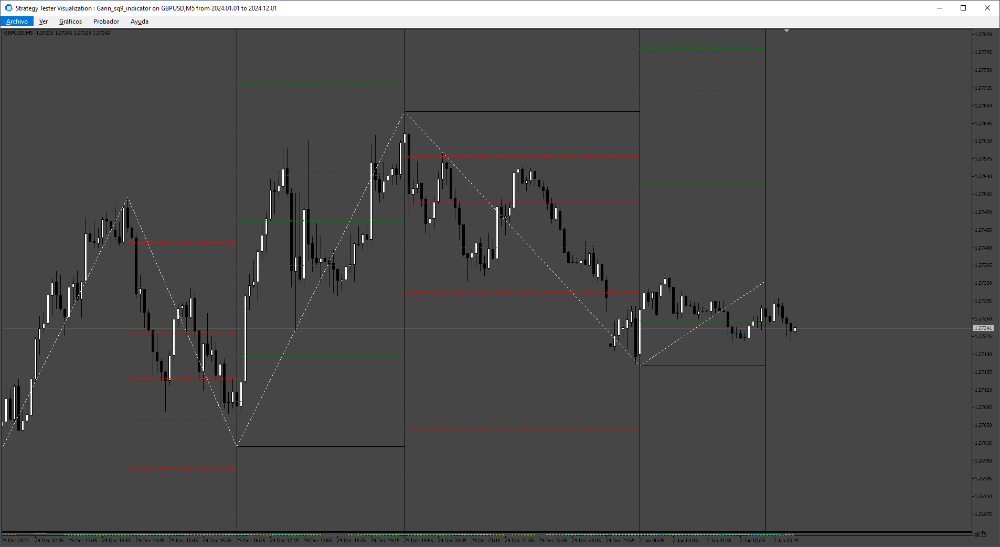

# gann-sq-9-indicator

> Source: https://fxcodebase.com/code/viewtopic.php?f=38&t=73941  
> Forum: 38 · Topic 73941 · 8 post(s)

---

## gann-sq-9-indicator

**Apprentice** · Mon Jul 17, 2023 2:30 pm

Based on the request.
[https://fxcodebase.com/code/viewtopic.php?f=38&t=73890](https://fxcodebase.com/code/viewtopic.php?f=38&t=73890)

 [gann-sq-9-indicator.mq4](files/151669/gann-sq-9-indicator.mq4)

---

## Re: gann-sq-9-indicator

**alema0** · Tue Nov 12, 2024 6:03 pm

Is it possible to convert this indicator to Mt5? Thanks

---

## Re: gann-sq-9-indicator

**Apprentice** · Thu Nov 14, 2024 3:53 am

We have added your request to the development list.
Development reference 848

---

## Re: gann-sq-9-indicator

**vitual_21** · Fri Nov 22, 2024 5:59 am

No arrow shown out.

---

## Re: gann-sq-9-indicator

**vitual_21** · Fri Nov 22, 2024 6:11 am

NO arrow shown in the chart

---

## Re: gann-sq-9-indicator

**Apprentice** · Fri Nov 22, 2024 12:55 pm

We have added your request to the development list.
Development reference 851

---

## Re: gann-sq-9-indicator

**Apprentice** · Sun Jul 13, 2025 1:51 pm

[gann-sq-9-indicator_v2.mq4](files/159911/gann-sq-9-indicator_v2.mq4)

Try this version.

---

## Re: gann-sq-9-indicator

**Apprentice** · Sun Aug 10, 2025 4:45 am

 [Gann_sq9_indicator.mq5](files/160186/Gann_sq9_indicator.mq5)
