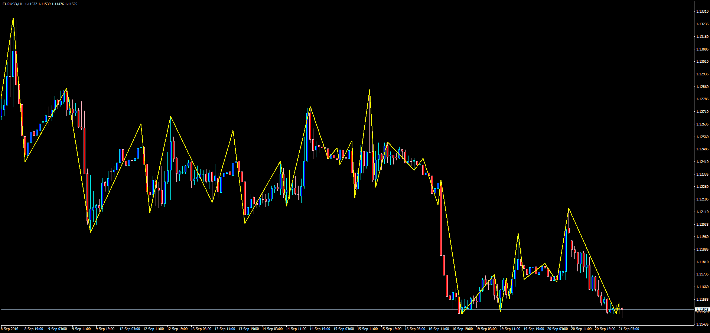
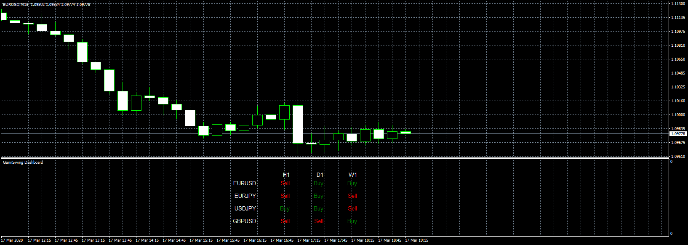
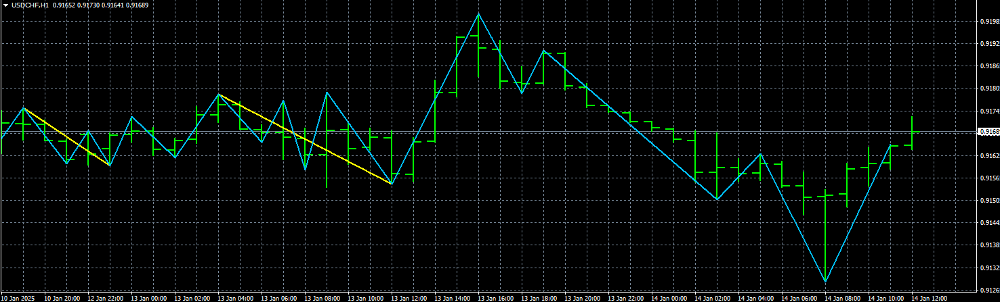

# Gann Swing

> Source: https://fxcodebase.com/code/viewtopic.php?f=38&t=63884  
> Forum: 38 · Topic 63884 · 24 post(s)

---

## Gann Swing

**Apprentice** · Wed Sep 21, 2016 3:54 am

Customized adaptation according to the following rules:
[viewtopic.php?f=17&t=294&hilit=Gann+Swing](https://fxcodebase.com/code/viewtopic.php?f=17&t=294&hilit=Gann+Swing)

Two consecutive Higher High candles indicate Upswing
Two consecutive Lower Low candles indicate Downswing
Swing lines connect either Highs or Lows of individual bars - never Open or Close
If the next bar has a higher high and a higher low (or the same low) when compared to the previous bar, then the swing line goes up connecting the high of the next bar
If the next bar has a lower high (or same high) and a lower low when compared to the previous bar, then the swing line goes down connecting the low of the next bar
If the next bar is an inside bar (lower high and higher low), ignore it and don’t plot a line on it at all – wait for the next bar.
If the next br is an outside bar (higher high and lower low)

 [GannSwing.mq4](files/108195/GannSwing.mq4)

 

 [GannSwing Dashboard.mq4](files/108195/GannSwing%20Dashboard.mq4)

---

## Re: Gann Swing

**Apprentice** · Thu Jun 25, 2020 4:54 am

GannSwing Dashboard.mq4 added.

---

## Re: Gann Swing

**logicgate** · Thu Jun 25, 2020 6:54 am

Excellent, gonna try it out! Thanks a lot

---

## Re: Gann Swing

**logicgate** · Thu Jul 30, 2020 10:41 am

Hey buddy can you add an option in GannSwing/Gann Swing Dashboard to choose the number of bars for the reversal? I don´t know if it is hard coded for 2 or 3, but I would like to test it with other values.

Best regards

---

## Re: Gann Swing

**logicgate** · Thu Jul 30, 2020 11:22 am

I posted an upgrade request a while ago, but as usual it got me thinking, and It would be even better if we could set the number of bars for reversal for each timeframe individually. I might wanna leave the daily in 2 bars, but perhaps 5min in 3 bars.

---

## Re: Gann Swing

**Apprentice** · Thu Jul 30, 2020 4:48 pm

Your request is added to the development list.
Development reference 1803

---

## Re: Gann Swing

**Apprentice** · Fri Jul 31, 2020 4:35 am

This indicator doesn't have any parameters for such customization.
 Do you need some other indicator?

You can read about the Gann Swing rules set here.
[viewtopic.php?f=17&t=294&hilit=Gann+Swing](https://fxcodebase.com/code/viewtopic.php?f=17&t=294&hilit=Gann+Swing)

Or do you want a Dashboard to display swing direction changes in last X candles?

---

## Re: Gann Swing

**logicgate** · Fri Jul 31, 2020 10:00 am

Hi there buddy. Of course you can change those parameter. The rules say that a change in swing direction happens when you have two consecutive higher highs (or lower lows), correct?

So in this case the indicator is hard coded to 2 bars reversal. If you use 3 bars, then a swing will change direction with three consecutive higher highs or lower lows, if set to 4 bars,4 consecutive higher highs/lower lows, and so on...

So, it would be great if we could change the rule for each timeframe on the dashboard, I may want the 5 min be set to 3 bar reversal, and hourly to 2, and 1min to 4, for example.

---

## Re: Gann Swing

**Apprentice** · Sun Aug 02, 2020 8:37 am

Your request is added to the development list.
Development reference 1814.

---

## Re: Gann Swing

**logicgate** · Thu Sep 03, 2020 2:55 pm

> **Apprentice wrote:**
> Your request is added to the development list.
> Development reference 1814.

Hello dear friend, I just hope you haven´t forgotten about this one.

Best regards, stay safe

---

## Re: Gann Swing

**Apprentice** · Fri Sep 04, 2020 1:55 am

Have moved the task to the top of the stack.
I hope someone notices it.

---

## Re: Gann Swing

**logicgate** · Wed Oct 28, 2020 4:03 am

Hi there buddy, hope you are going good.

No progress in this so far?

---

## Re: Gann Swing

**logicgate** · Sat Oct 31, 2020 5:34 am

> **Apprentice wrote:**
> Have moved the task to the top of the stack.
> I hope someone notices it.

You are not the one tackling this task? I never seen this taking over a month to complete... I am not demanding anything or putting pressure, just sincerely wanted to know why is that, the indicator is already completed, this last request was just the additions of a couple of new parameters, so I figured that would be very easy to you.. Anyways, thanks for looking into it.

---

## Re: Gann Swing

**Apprentice** · Sun Nov 01, 2020 8:34 am

Completion time will depend on the availability and willingness of the developer to work on a particular task.

If you know a willing and able developer please refer him to me.

---

## Re: Gann Swing

**logicgate** · Sat Dec 05, 2020 7:50 am

Hi there dear friend,

Where we are regarding this last request?

---

## Re: Gann Swing

**logicgate** · Sat Dec 12, 2020 3:38 am

Guys, can someone please pick this up?

The indicator is almost ready, it just needs some extra inputs...

Why throw away this one?: As is it is unusable.

---

## Re: Gann Swing

**Apprentice** · Mon Jan 04, 2021 4:35 am

[GannSwing.mq4](files/139982/GannSwing.mq4)

 [GannSwing Dashboard.mq4](files/139982/GannSwing%20Dashboard.mq4)

Try this version.

---

## Re: Gann Swing

**logicgate** · Wed Jan 13, 2021 11:38 am

Wow I have just saw this! Thanks a lot brother, gonna check it out!

---

## Re: Gann Swing

**logicgate** · Wed Nov 20, 2024 9:32 am

Hello dear friend apprentice, can we get a MT5 version of this, please?

Best regards

---

## Re: Gann Swing

**Apprentice** · Fri Nov 22, 2024 1:07 pm

We have added your request to the development list.
Development reference 861

---

## Re: Gann Swing

**logicgate** · Sun Nov 24, 2024 4:33 am

Hi there dear friend, you have to check the code for some small bug because the input for bars for reversal is not working, it does not do anything no matter the value you put there.

---

## Re: Gann Swing

**Apprentice** · Wed Nov 27, 2024 2:48 pm

We have added your request to the development list.
Development reference 880

---

## Re: Gann Swing

**Apprentice** · Wed Jan 15, 2025 4:51 am

It works. 1 vs 2

---

## Re: Gann Swing

**Apprentice** · Wed Apr 23, 2025 3:47 am

 [GannSwing.mq5](files/159015/GannSwing.mq5)

 [GannSwing_Dashboardv2.mq5](files/159015/GannSwing_Dashboardv2.mq5)
