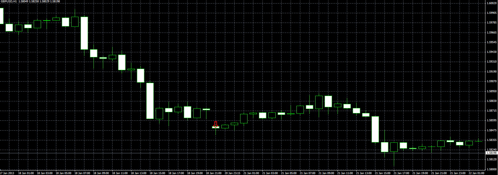
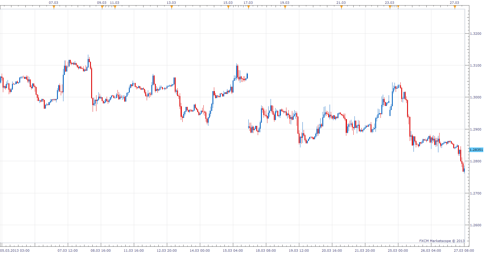

# Gap finder

> Source: https://fxcodebase.com/code/viewtopic.php?f=38&t=31485  
> Forum: 38 · Topic 31485 · 14 post(s)

---

## Gap finder

**Alexander.Gettinger** · Mon Jan 28, 2013 4:33 pm

The indicator shows gaps in the price chart.

 

Download:

 [GapFinder.mq4](files/53716/GapFinder.mq4)

---

## Re: Gap finder

**Coondawg71** · Mon Mar 18, 2013 1:41 pm

Would love to have this in Lua please.

Thanks,

sjc

---

## Re: Gap finder

**Apprentice** · Tue Mar 19, 2013 9:38 am

Your request is added to the developmental list.

---

## Re: Gap finder

**Jeffreyvnlk** · Mon Apr 01, 2013 7:43 am

Appreciated if this one could be released soon. The problem with TradeStation of FXCM that it eliminated any kind of gap. Nick Robocon offers around 20$ for buying this kind of indicator but i would be glad that the team could make it into being soon

---

## Re: Gap finder

**Apprentice** · Tue Apr 02, 2013 5:27 am

As I understand this.
This is not TradeStation problem, it is FXCM server data issue.
I will consult the development team.

---

## Re: Gap finder

**Apprentice** · Tue Apr 02, 2013 5:59 am

As you can see from this chart, Gap can be found from time to time.
In the forex market, they can occur only during non trading days, weekends.
Possible on smaller time frames, only with a broker who have limited access to the market.

---

## Re: Gap finder

**evansrono** · Tue Aug 04, 2020 6:40 am

HI,

is it possible to have a summation of the gaps from and including a specific candle going back to a specified eg. 20 or 30 candles (the last candle gap include)?. Maybe use verticle lines as the range.

Thanks.

---

## Re: Gap finder

**Apprentice** · Wed Aug 05, 2020 4:19 am

As a number of gaps in last X candles?

---

## Re: Gap finder

**evansrono** · Wed Aug 05, 2020 10:53 am

Hi.

Yes. But not from the current candle, from a specific past candle to another counting backwards(both candle gap values included).

Thanks.

---

## Re: Gap finder

**Apprentice** · Thu Aug 06, 2020 4:00 am

Your request is added to the development list.
Development reference 1839.

---

## Re: Gap finder

**evansrono** · Thu Aug 06, 2020 5:41 am

Hi.

Forgot to mention, in MT4 please. And, why are the gaps different with each broker?

Regards.

---

## Re: Gap finder

**Apprentice** · Fri Aug 07, 2020 5:22 am

I don't understand how it should look like.
Oscillator?

---

## Re: Gap finder

**evansrono** · Sat Aug 08, 2020 6:19 am

Hi.

The attached shows pip value for the gaps. My request was for those gap pip values of each candle to be summed from a certain date and time (or candle) - not current candle, to another date and time (or candle) going backwards, to know the Total pips of the gaps in that range.

Regards.

---

## Re: Gap finder

**Apprentice** · Tue Aug 11, 2020 4:11 am

Try this version.
[viewtopic.php?f=38&t=70282&p=136770#p136770](https://fxcodebase.com/code/viewtopic.php?f=38&t=70282&p=136770#p136770)
